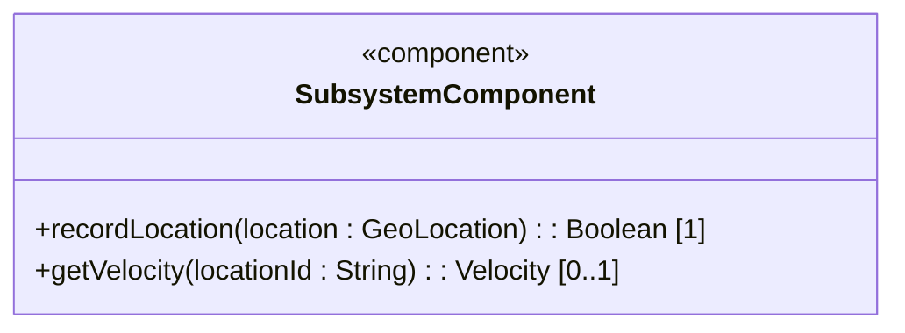
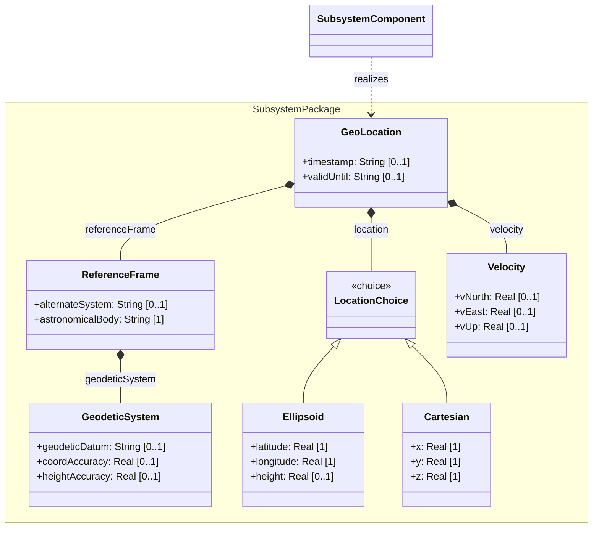
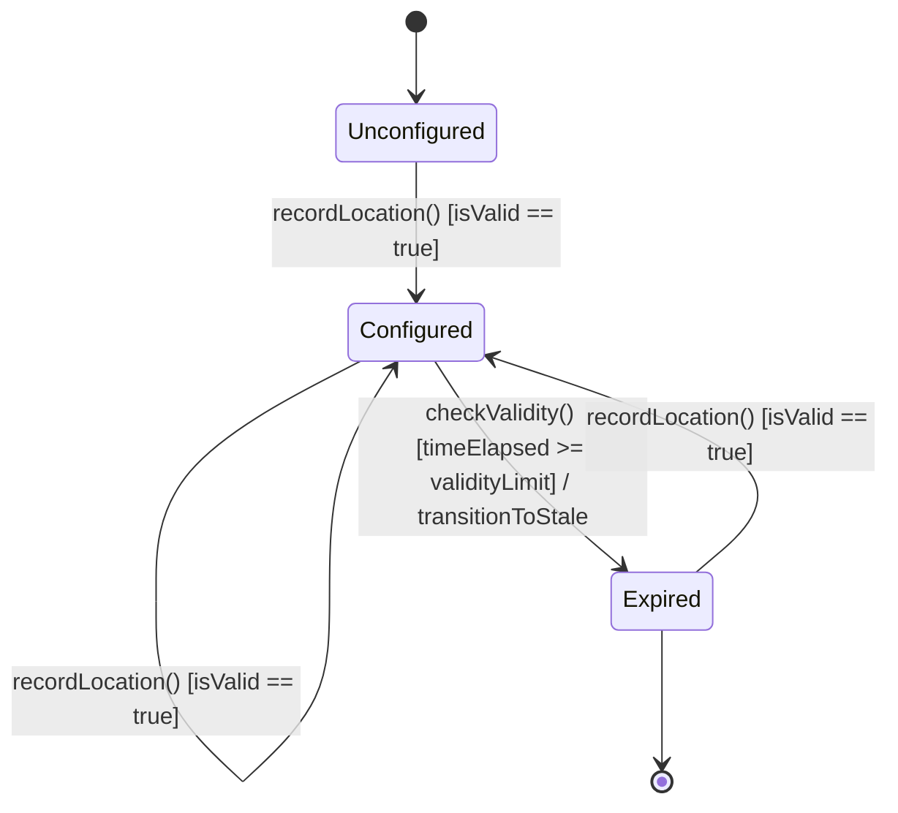

# Epic: Geographic Location: Location Management

## 1. Context
This Epic coordinates the specification-engineering of BCP 14/RFC 9179 ("A YANG Grouping for Geographic Locations"). It structures the core geographic location grouping `geo-location`, enclosing astronomical body frames of reference, geodetic datums, spatial coordinate representation choices (Ellipsoidal vs Cartesian), velocity and motion profiles, and temporal validity/expiration attributes.

## 2. Requirements & Checklist
- [ ] #1 - Feature 1: Reference Frame Configuration (https://github.com/gintatkinson/digipipe-tst20/blob/main/docs/features/feat-01-reference-frame.md)
- [ ] #2 - Feature 2: Spatial Coordinate Representation (https://github.com/gintatkinson/digipipe-tst20/blob/main/docs/features/feat-02-spatial-coordinates.md)
- [ ] #3 - Feature 3: Velocity and Motion Profile (https://github.com/gintatkinson/digipipe-tst20/blob/main/docs/features/feat-03-velocity-motion.md)
- [ ] #4 - Feature 4: Temporal and Validity Attributes (https://github.com/gintatkinson/digipipe-tst20/blob/main/docs/features/feat-04-temporal-validity.md)

### Associated Use Cases & User Stories

#### Associated Use Cases
- [ ] #10 - Use Case 1: Record Geographic Location (Issue #10)
- [ ] #11 - Use Case 2: Query Motion Vectors and Derive Speed and Heading (Issue #11)
- [ ] #12 - Use Case 3: Monitor Location Validity and Handle Expiry (Issue #12)

#### Associated User Stories
- [ ] #6 - User Story 1: Record Ellipsoidal Geographic Location (Issue #6)
- [ ] #7 - User Story 2: Record Cartesian Geographic Location (Issue #7)
- [ ] #8 - User Story 3: Derive Motion Speed and Heading from Velocity Vectors (Issue #8)
- [ ] #9 - User Story 4: Monitor Record Validity and Transition Stale Location State (Issue #9)

## 3. Architecture and System Interaction Diagrams

### Subsystem Component Definition
Define the subsystem representing the Epic as a UML Component specifying provided/required interfaces and operations.


## System-Level UML Class Diagram


## 4. State Machine Definitions

## System State Machine Diagram


## 5. Specification Context
```text
   The grouping defines a container object for specifying a location on
   or around an astronomical object (e.g., 'earth').

   This grouping is designed to be flexible and extensible. It allows
   the location to be described in ellipsoidal (latitude, longitude,
   height) or Cartesian coordinates, and includes velocity vectors to
   describe stable motion.
```

## 6. Source References
YANG Schema: [ietf-geo-location.yang](https://github.com/YangModels/yang/blob/main/standard/ietf/RFC/ietf-geo-location%402022-02-11.yang)
Normative Specification: [RFC 9179](https://datatracker.ietf.org/doc/rfc9179/)
