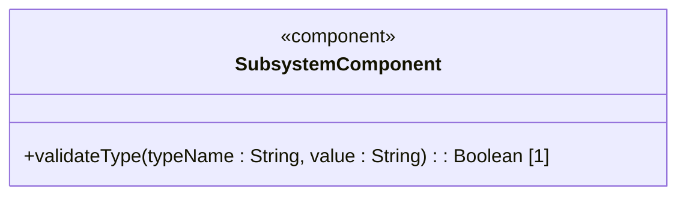
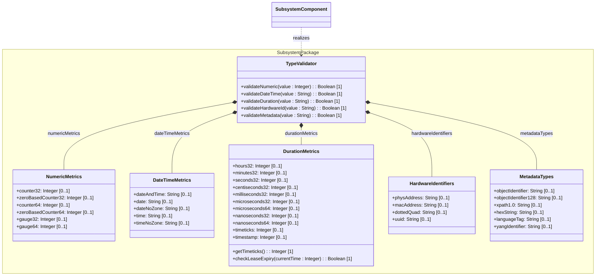
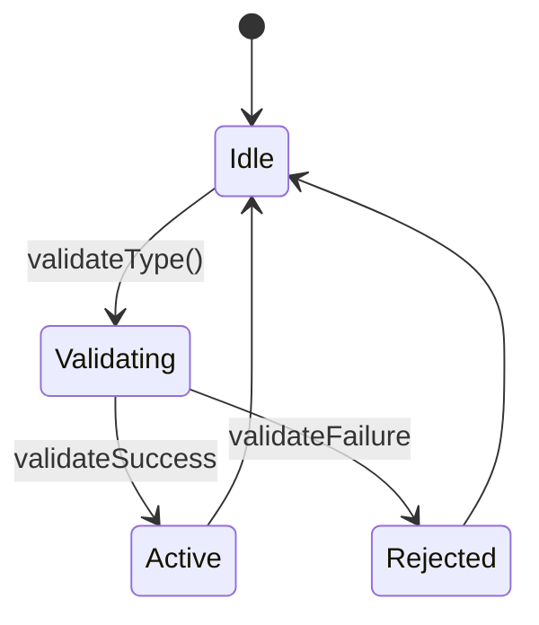

# Epic: Common Data Types: Type Validation and Metrics Management

## 1. Context
This Epic coordinates the specification-engineering of BCP 14/RFC 9911 ("Common YANG Data Types"). It structures the validation rules, constraints, and schemas for 32 standard YANG derived types (typedefs) grouped into numeric metrics, date/time representations, duration/measurement units, hardware identifiers, and metadata tags.

## 2. Requirements & Checklist
- [ ] #13 - Feature: Numeric Metric Types (https://github.com/gintatkinson/digipipe-tst20/blob/main/docs/features/feat-05-numeric-metrics.md)
- [ ] #14 - Feature: Date and Time Types (https://github.com/gintatkinson/digipipe-tst20/blob/main/docs/features/feat-06-date-time.md)
- [ ] #15 - Feature: Duration and Measurement Units (https://github.com/gintatkinson/digipipe-tst20/blob/main/docs/features/feat-07-duration-measurement.md)
- [ ] #16 - Feature: Network and Hardware Identifier Types (https://github.com/gintatkinson/digipipe-tst20/blob/main/docs/features/feat-08-hardware-identifiers.md)
- [ ] #17 - Feature: Metadata and Language Tag Types (https://github.com/gintatkinson/digipipe-tst20/blob/main/docs/features/feat-09-metadata-language.md)

### Associated Use Cases & User Stories

#### Associated Use Cases
- [ ] #23 - Use Case 4: Validate Standard YANG Type Constraints (Issue #23)
- [ ] #24 - Use Case 5: Process Time and Duration Metrics (Issue #24)
- [ ] #25 - Use Case 6: Manage Session Expiry using Timeticks (Issue #25)

#### Associated User Stories
- [ ] #19 - User Story 5: Validate Hardware and Network Identifiers (Issue #19)
- [ ] #20 - User Story 6: Monitor Gauge Thresholds and Wrap Counters (Issue #20)
- [ ] #21 - User Story 7: Convert Timeticks and High-Resolution Durations (Issue #21)
- [ ] #22 - User Story 8: Evaluate Lease Validity and Timeout Expirations (Issue #22)

## 3. Architecture and System Interaction Diagrams

### Subsystem Component Definition
Define the subsystem representing the Epic as a UML Component specifying provided/required interfaces and operations.


## System-Level UML Class Diagram


## 4. State Machine Definitions

## System State Machine Diagram


## 5. Specification Context
```text
   This YANG module defines a collection of generally useful derived
   YANG data types representing counters, gauges, IP/MAC addresses,
   time parameters, UUIDs, and metadata identifiers.
```

## 6. Source References
YANG Schema: [ietf-yang-types.yang](https://github.com/YangModels/yang/blob/main/standard/ietf/RFC/ietf-yang-types%402025-12-22.yang)
Normative Specification: [RFC 9911](https://datatracker.ietf.org/doc/rfc9911/)
