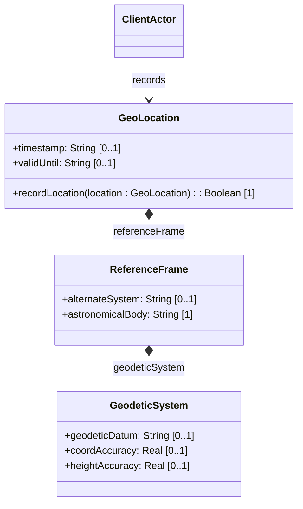

# Feature: Reference Frame Configuration

## Description
This feature provides the capability to configure the Frame of Reference and Geodetic System for geographic location coordinates. It specifies the astronomical body (defaulting to Earth), optional geodetic datum definitions (defaulting to WGS-84 on Earth), coordinate accuracies, and supports alternate coordinate systems (such as virtual realities).

## UML Class Diagram


## Functional UI Requirements
### 1. Test Data Shape (JSON Payload Example)
```json
{
  "geo-location": {
    "reference-frame": {
      "alternate-system": "virtual-mars-sim",
      "astronomical-body": "mars",
      "geodetic-system": {
        "geodetic-datum": "mola-2000",
        "coord-accuracy": 0.000100,
        "height-accuracy": 0.500000
      }
    }
  }
}
```

### 2. Validation & Constraints
- `alternate-system`: Optional ASCII string. Only evaluated if the `alternate-systems` feature is supported by the device.
- `astronomical-body`: ASCII string. Converting uppercase to lowercase is recommended. Preceding "the" should not be included. Pattern constraint: `[ -@\[-\^_-~]*` (ASCII characters 32-126 excluding control characters). Default is `"earth"`.
- `geodetic-datum`: ASCII string. Restricts all spaces to dashes in registered datums. Pattern constraint: `[ -@\[-\^_-~]*`. Default when the astronomical body is `"earth"` is `"wgs-84"`.
- `coord-accuracy`: 64-bit decimal (Real) with exactly 6 fraction digits. Represents uncertainty of coordinates.
- `height-accuracy`: 64-bit decimal (Real) with exactly 6 fraction digits. Units must be `"meters"`. Represents uncertainty of height.

### 3. Visual Layout & Arrangement
- **Reference Frame Header**: Primary layout section grouping all configuration attributes.
- **Astronomical Body Selector**: Single-select dropdown or input box with default "earth" pre-filled.
- **Geodetic System Panel**: Sub-panel displaying Datum, Coordinate Accuracy, and Height Accuracy with clear labeling of units.
- **Alternate System Field**: Input box conditionally visible/enabled if `alternate-systems` capability is active.

### 4. Interactive Flow & States
- **Default State**: Astronomical body field displays "earth" in lowercase. Datum defaults to WGS-84. Accuracies are blank.
- **Validation State**: Highlights inputs violating ASCII character bounds or decimal precision constraints.
- **Disabled State**: Alternate System input displays a tooltip "Alternate reference frame systems not supported" when the feature is inactive.

## Code Realization Table
| Feature/Attribute | Source File | Class/Type | Function/Method | Notes |
|---|---|---|---|---|
| alternate-system | yang/ietf-geo-location.yang | ReferenceFrame | alternateSystem | Conditioned on alternate-systems |
| astronomical-body | yang/ietf-geo-location.yang | ReferenceFrame | astronomicalBody | Default is earth |
| geodetic-datum | yang/ietf-geo-location.yang | GeodeticSystem | geodeticDatum | Default is wgs-84 if earth |
| coord-accuracy | yang/ietf-geo-location.yang | GeodeticSystem | coordAccuracy | Decimal64, 6 digits |
| height-accuracy | yang/ietf-geo-location.yang | GeodeticSystem | heightAccuracy | Decimal64, 6 digits, meters |

## Given-When-Then Acceptance Criteria
### Scenario: Default Reference Frame Initialization
Given the reference frame has not been explicitly configured
When the system initializes the location context
Then the astronomical-body attribute defaults to "earth"
And the geodetic-datum attribute defaults to "wgs-84"

### Scenario: Setting Geodetic Datum with Non-ASCII Characters
Given a user attempts to configure the geodetic datum
When they input "wgs-84-©" (containing non-ASCII symbol)
Then the system rejects the input with a validation error indicating pattern mismatch

### Scenario: Setting Coordinate Accuracy Beyond Permitted Decimals
Given a coordinate accuracy input of 0.12345678 (8 fraction digits)
When the geodetic system is saved
Then the system normalizes or rounds the coord-accuracy value to exactly 6 fraction digits (0.123457)

## Specification Context (Verbatim)
```text
   The geodetic-system container defines the geodetic system of the
   location data.

   The geodetic-datum leaf defines the geodetic datum.  The default
   value for astronomical-body is 'earth', and the default geodetic-
   datum is 'wgs-84'.
```

## 4. Source References
Structural Schema: [ietf-geo-location.yang](https://github.com/YangModels/yang/blob/main/standard/ietf/RFC/ietf-geo-location%402022-02-11.yang)
Normative Specification: [RFC 9179 Section 2.1](https://datatracker.ietf.org/doc/rfc9179/)
