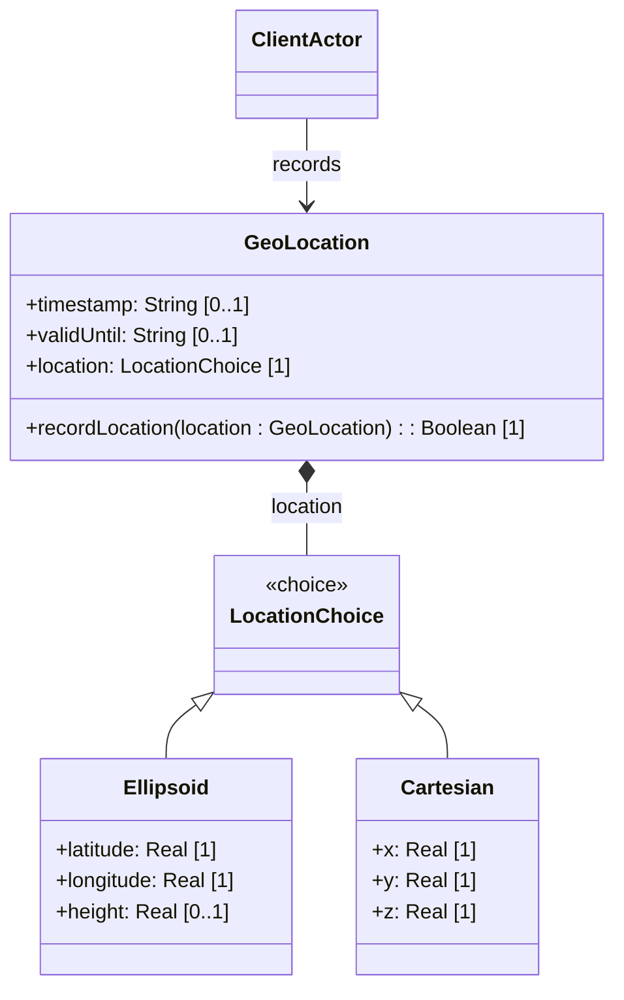

# Feature: Spatial Coordinate Representation

## Description
This feature manages the spatial coordinates representing the geographical location. It supports mutually exclusive choice cases for coordinate representation: either ellipsoidal coordinates (latitude, longitude, and optional height) or geocentric Cartesian coordinates (X, Y, Z).

## UML Class Diagram


## Functional UI Requirements
### 1. Test Data Shape (JSON Payload Example)
```json
{
  "geo-location": {
    "latitude": 37.7749000000000000,
    "longitude": -122.4194000000000000,
    "height": 10.500000
  }
}
```

### 2. Validation & Constraints
- `location` choice: Mutually exclusive choice between ellipsoidal and Cartesian data. Providing both coordinates or mixing fields is invalid.
- `latitude`: 64-bit decimal (Real), exactly 16 fraction digits. Units: `"decimal degrees"`. Must be within range `[-90.0, 90.0]`.
- `longitude`: 64-bit decimal (Real), exactly 16 fraction digits. Units: `"decimal degrees"`. Must be within range `[-180.0, 180.0]`.
- `height`: 64-bit decimal (Real), exactly 6 fraction digits. Units: `"meters"`.
- `x`: 64-bit decimal (Real), exactly 6 fraction digits. Units: `"meters"`.
- `y`: 64-bit decimal (Real), exactly 6 fraction digits. Units: `"meters"`.
- `z`: 64-bit decimal (Real), exactly 6 fraction digits. Units: `"meters"`.

### 3. Visual Layout & Arrangement
- **Coordinate System Toggle**: Tab group or radio buttons switching between "Ellipsoidal" and "Cartesian" layouts.
- **Ellipsoidal Layout Section**:
  - Two parallel inputs for Latitude and Longitude (side-by-side) with labels and degree units.
  - Below them, an optional Height field in meters.
- **Cartesian Layout Section**:
  - Three parallel or stacked input fields for X, Y, and Z coordinates with meter units.

### 4. Interactive Flow & States
- **Ellipsoidal Mode Active**: X, Y, and Z fields are hidden/cleared. Entering values in Latitude or Longitude updates the ellipsoidal data structure.
- **Cartesian Mode Active**: Latitude, Longitude, and Height fields are hidden/cleared. Entering values in X, Y, or Z updates the Cartesian data structure.
- **Out of Bounds State**: Highlights Latitude/Longitude red if inputs exceed `[-90.0, 90.0]` or `[-180.0, 180.0]` respectively, with helper text.

## Code Realization Table
| Feature/Attribute | Source File | Class/Type | Function/Method | Notes |
|---|---|---|---|---|
| location | yang/ietf-geo-location.yang | LocationChoice | location | Choice name |
| latitude | yang/ietf-geo-location.yang | Ellipsoid | latitude | Decimal64, 16 digits, degrees |
| longitude | yang/ietf-geo-location.yang | Ellipsoid | longitude | Decimal64, 16 digits, degrees |
| height | yang/ietf-geo-location.yang | Ellipsoid | height | Decimal64, 6 digits, meters |
| x | yang/ietf-geo-location.yang | Cartesian | x | Decimal64, 6 digits, meters |
| y | yang/ietf-geo-location.yang | Cartesian | y | Decimal64, 6 digits, meters |
| z | yang/ietf-geo-location.yang | Cartesian | z | Decimal64, 6 digits, meters |

## Given-When-Then Acceptance Criteria
### Scenario: Switch Coordinate System Mode
Given the coordinate layout is in "Ellipsoidal" mode
When the user selects the "Cartesian" coordinate toggle
Then the Latitude, Longitude, and Height inputs are cleared and hidden
And the X, Y, and Z inputs are displayed for geocentric Cartesian values

### Scenario: Latitude Out of Bounds Validation
Given the system is in Ellipsoidal coordinate mode
When a user enters a Latitude value of 95.0000000000000000
Then the system marks the field as invalid and rejects the payload

### Scenario: Height Precision Constraints
Given a Cartesian X coordinate input of 6378137.12345678 (8 decimal places)
When the location data is saved
Then the system rounds or normalizes the x attribute to exactly 6 fraction digits (6378137.123457)

## Specification Context (Verbatim)
```text
   The location choice specifies the location data either in latitude/
   longitude (ellipsoid) or Cartesian values.

   latitude is the latitude value on the astronomical body.
   longitude is the longitude value on the astronomical body.
```

## 4. Source References
Structural Schema: [ietf-geo-location.yang](https://github.com/YangModels/yang/blob/main/standard/ietf/RFC/ietf-geo-location%402022-02-11.yang)
Normative Specification: [RFC 9179 Section 2.2](https://datatracker.ietf.org/doc/rfc9179/)
