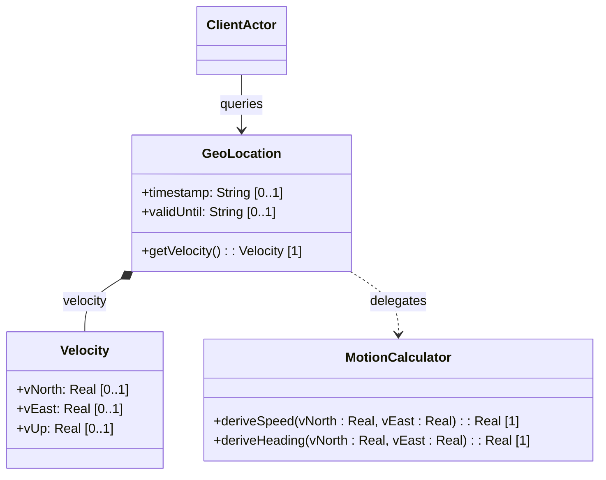

# Feature: Velocity and Motion Profile

## Description
This feature provides support for location coordinates of objects in relatively stable motion. It defines a three-dimensional velocity vector specifying the rates of change towards true north, east, and center-of-mass vertical axis (up). It also provides the basis for computing speed and heading.

## UML Class Diagram


## Functional UI Requirements
### 1. Test Data Shape (JSON Payload Example)
```json
{
  "geo-location": {
    "velocity": {
      "v-north": 15.500000000000,
      "v-east": -5.250000000000,
      "v-up": 0.100000000000
    }
  }
}
```

### 2. Validation & Constraints
- `v-north`: 64-bit decimal (Real), exactly 12 fraction digits. Units: `"meters per second"`. Speed towards true north.
- `v-east`: 64-bit decimal (Real), exactly 12 fraction digits. Units: `"meters per second"`. Speed perpendicular to the right of true north.
- `v-up`: 64-bit decimal (Real), exactly 12 fraction digits. Units: `"meters per second"`. Speed away from the astronomical body's center of mass.

### 3. Visual Layout & Arrangement
- **Motion Parameters Section**: Grouped UI container labeled "Object Motion Profile" with a toggle "Enable Motion Tracking".
- **Velocity Input Grid**:
  - Three numeric input boxes side-by-side: North, East, and Up.
  - Labels for each showing `m/s` unit designation.
- **Derived Metrics Subpanel**: Displays calculated "Derived Horizontal Speed" and "Derived Heading" dynamically based on input velocity parameters.

### 4. Interactive Flow & States
- **Motion Inactive State**: Velocity fields are disabled and display grayed-out zeros.
- **Motion Active State**: Input fields are enabled. Modifying any velocity input triggers recalculation of derived speed and heading in the UI.
- **Rounding State**: Inputs with decimal places exceeding 12 are rounded to 12 digits upon loss of focus.

## Code Realization Table
| Feature/Attribute | Source File | Class/Type | Function/Method | Notes |
|---|---|---|---|---|
| velocity | yang/ietf-geo-location.yang | GeoLocation | velocity | Container name |
| v-north | yang/ietf-geo-location.yang | Velocity | vNorth | Decimal64, 12 digits, m/s |
| v-east | yang/ietf-geo-location.yang | Velocity | vEast | Decimal64, 12 digits, m/s |
| v-up | yang/ietf-geo-location.yang | Velocity | vUp | Decimal64, 12 digits, m/s |

## Given-When-Then Acceptance Criteria
### Scenario: Motion Profile Inactive by Default
Given a new geographic location registration
When no velocity values are supplied
Then the velocity container remains unconfigured and is omitted from the serialization

### Scenario: High-Precision Decimal Velocity Inputs
Given the motion tracking system is active
When the user inputs a v-north rate of 0.000000000025123 (15 decimals)
Then the system stores the v-north attribute rounded to exactly 12 fraction digits (0.000000000025)

### Scenario: Negative Vertical Velocity Representing Descent
Given a descending object
When v-up is configured as -2.500000000000 m/s
Then the system accepts the negative value, indicating motion towards the center of mass

## Specification Context (Verbatim)
```text
   The velocity container represents the velocity vector if the object
   is in motion.

   v-north is the rate of change (i.e., speed) towards true north as
   defined by the geodetic-system.
   v-east is the rate of change (i.e., speed) perpendicular to the right
   of true north as defined by the geodetic-system.
   v-up is the rate of change (i.e., speed) away from the center of
   mass.
```

## 4. Source References
Structural Schema: [ietf-geo-location.yang](https://github.com/YangModels/yang/blob/main/standard/ietf/RFC/ietf-geo-location%402022-02-11.yang)
Normative Specification: [RFC 9179 Section 2.3](https://datatracker.ietf.org/doc/rfc9179/)
