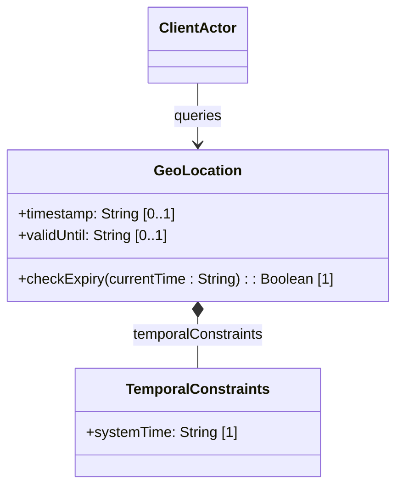

# Feature: Temporal and Validity Attributes

## Description
This feature provides timestamping capabilities for geographic location records. It records the precise observation time of the location coordinate (timestamp) and allows defining a lifecycle expiration threshold (valid-until), beyond which the location data is considered stale or invalid.

## UML Class Diagram


## Functional UI Requirements
### 1. Test Data Shape (JSON Payload Example)
```json
{
  "geo-location": {
    "timestamp": "2026-06-15T16:00:00Z",
    "valid-until": "2026-06-15T17:00:00Z"
  }
}
```

### 2. Validation & Constraints
- `timestamp`: String formatted as RFC 3339 `date-and-time` (yang:date-and-time type). Represents the time location was recorded.
- `valid-until`: String formatted as RFC 3339 `date-and-time`. Represents expiration threshold.
- **Logical Constraint**: If `valid-until` is specified, it MUST be chronologically equal to or after the `timestamp` value.

### 3. Visual Layout & Arrangement
- **Validity and Lifecycle Sub-section**: Form section labeled "Record Lifespan and Expiry".
- **Timestamp Display**: Text field or calendar date-time picker showing the recording/observation timestamp.
- **Expiration Date Picker**: Optional calendar picker enabling selection of the validity expiration date-time.
- **Validity Status Indicator**: Badge or banner displaying the status of the record: "Valid" (green) or "Stale / Expired" (amber/red).

### 4. Interactive Flow & States
- **Dynamic Expiration Warning**: If the current system time exceeds the `valid-until` timestamp, the status indicator automatically transitions to "Stale / Expired".
- **Chronology Lock**: Setting a `valid-until` date prior to `timestamp` highlights both fields in red, disabling the save button and displaying the warning "Expiration time cannot precede the recording timestamp".

## Code Realization Table
| Feature/Attribute | Source File | Class/Type | Function/Method | Notes |
|---|---|---|---|---|
| timestamp | yang/ietf-geo-location.yang | GeoLocation | timestamp | RFC 3339 date-and-time |
| valid-until | yang/ietf-geo-location.yang | GeoLocation | validUntil | RFC 3339 date-and-time |

## Given-When-Then Acceptance Criteria
### Scenario: Expiration Time Precedes Recording Timestamp
Given a geographic location record with a timestamp of "2026-06-15T16:00:00Z"
When a user attempts to set valid-until to "2026-06-15T15:00:00Z" (one hour prior)
Then the system rejects the input with a validation error indicating invalid chronological sequence

### Scenario: Location Lifetime Expiry
Given a location record with valid-until set to "2026-06-15T16:10:00Z"
When the system time is queried at "2026-06-15T16:11:00Z"
Then the system classifies the record state as expired/stale

### Scenario: Unspecified Expiration Defaults to Infinite Validity
Given a location record with a timestamp of "2026-06-15T16:00:00Z"
When the valid-until attribute is omitted (unspecified)
Then the location has no specific expiration time and remains valid indefinitely

## Specification Context (Verbatim)
```text
   timestamp is the reference time when location was recorded.

   valid-until is the timestamp for which this geo-location is valid
   until.  If unspecified, the geo-location has no specific expiration
   time.
```

## 4. Source References
Structural Schema: [ietf-geo-location.yang](https://github.com/YangModels/yang/blob/main/standard/ietf/RFC/ietf-geo-location%402022-02-11.yang)
Normative Specification: [RFC 9179 Section 2.7](https://datatracker.ietf.org/doc/rfc9179/)
