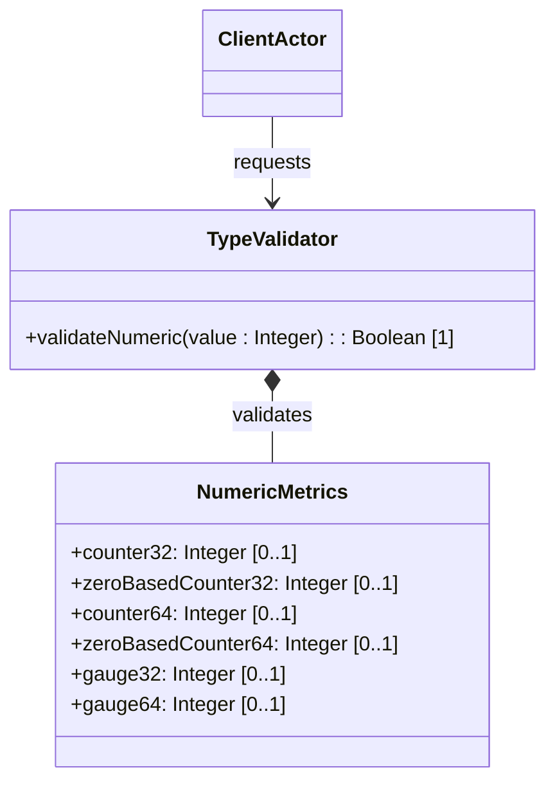

# Feature: Numeric Metric Types

## Description
This feature provides validation and schema conformance checks for standard YANG numeric metric types representing monotonically increasing counters and variable gauges (counter32, zero-based-counter32, counter64, zero-based-counter64, gauge32, gauge64).

## UML Class Diagram


## Functional UI Requirements
### 1. Test Data Shape (JSON Payload Example)
```json
{
  "counter32": 4294967295,
  "zero-based-counter32": 0,
  "counter64": 18446744073709551615,
  "zero-based-counter64": 100,
  "gauge32": 50000,
  "gauge64": 90000000000000
}
```

### 2. Validation & Constraints
- `counter32`: Unsigned 32-bit Integer (`[0, 4294967295]`). Monotonically increases, wraps to 0. Cannot be used for configuration nodes. Default values should not be specified.
- `zero-based-counter32`: Inherits constraints of `counter32` but has a defined default/initial value of `0`.
- `counter64`: Unsigned 64-bit Integer (`[0, 18446744073709551615]`). Monotonically increases, wraps to 0. Cannot be used for configuration nodes.
- `zero-based-counter64`: Inherits constraints of `counter64` but has a defined default/initial value of `0`.
- `gauge32`: Unsigned 32-bit Integer (`[0, 4294967295]`). Represents a variable metric that can increase or decrease.
- `gauge64`: Unsigned 64-bit Integer (`[0, 18446744073709551615]`). Represents a variable metric that can increase or decrease.

### 3. Visual Layout & Arrangement
- **Metrics Dashboard Grid**:
  - Top row: Counters displaying current values and wrap status warnings.
  - Bottom row: Gauges displaying current levels using horizontal bar/gauge indicators.
- **Validation Warnings**: Real-time validation badge showing "Read-Only / Operational-Only" next to counter fields, preventing manual configuration.

### 4. Interactive Flow & States
- **Counter Increment State**: Values increment monotonically. If a value reaches the maximum limit, the UI displays a transient "Wrap-around" status badge and resets the value to zero.
- **Config Edit State**: Gauges allow input edits; counter fields are rendered read-only, throwing a warning "Counters cannot be modified manually" if clicked.

## Code Realization Table
| Feature/Attribute | Source File | Class/Type | Function/Method | Notes |
|---|---|---|---|---|
| counter32 | yang/ietf-yang-types.yang | NumericMetrics | counter32 | 32-bit unsigned counter |
| zero-based-counter32 | yang/ietf-yang-types.yang | NumericMetrics | zeroBasedCounter32 | Initial value 0 |
| counter64 | yang/ietf-geo-location.yang | NumericMetrics | counter64 | 64-bit unsigned counter |
| zero-based-counter64 | yang/ietf-geo-location.yang | NumericMetrics | zeroBasedCounter64 | Initial value 0 |
| gauge32 | yang/ietf-geo-location.yang | NumericMetrics | gauge32 | 32-bit unsigned gauge |
| gauge64 | yang/ietf-geo-location.yang | NumericMetrics | gauge64 | 64-bit unsigned gauge |

## Given-When-Then Acceptance Criteria
### Scenario: Counter32 Maximum Value Wrap-Around
Given a counter32 variable is at its maximum value of 4294967295
When the system increments the counter value by 1
Then the counter32 value resets/wraps to 0

### Scenario: Counter Configuration Restriction
Given a configuration schema node edit form
When the system renders the form attributes
Then the counter32 and counter64 fields are rendered as read-only and cannot be manually modified

### Scenario: Gauge Value Decrease
Given a gauge32 variable initialized to 1000
When the gauge level drops by 500
Then the gauge32 value is successfully updated to 500

## Specification Context (Verbatim)
```text
   The counter32 type represents a non-negative integer that
   monotonically increases until it reaches a maximum value of 2^32-1
   (4294967295 decimal), when it wraps around and starts increasing
   again from zero.
```

## 4. Source References
Structural Schema: [ietf-yang-types.yang](https://github.com/YangModels/yang/blob/main/standard/ietf/RFC/ietf-yang-types%402025-12-22.yang)
Normative Specification: [RFC 9911 Section 3](https://datatracker.ietf.org/doc/rfc9911/)
