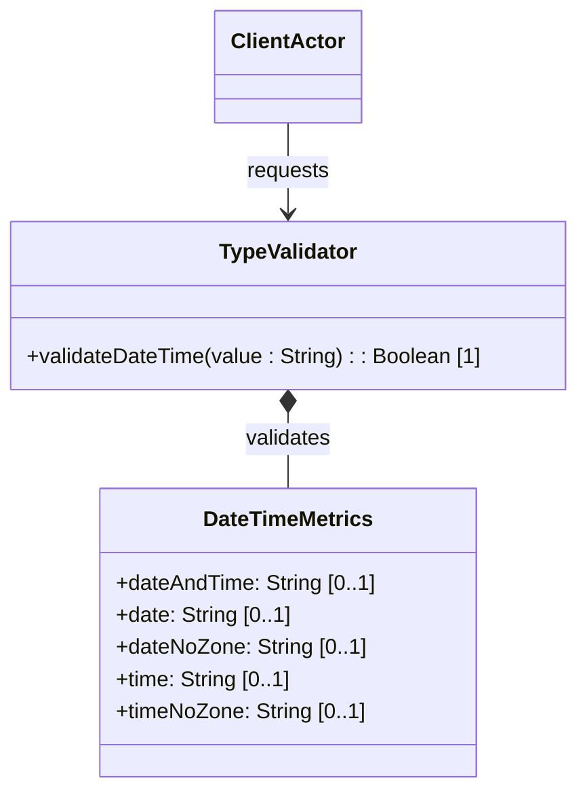

# Feature: Date and Time Types

## Description
This feature provides validation and format checking for standard date and time data types (date-and-time, date, date-no-zone, time, time-no-zone), supporting time zone offsets and leap seconds according to the updated standards.

## UML Class Diagram


## Functional UI Requirements
### 1. Test Data Shape (JSON Payload Example)
```json
{
  "date-and-time": "2026-06-15T16:00:00.123+08:00",
  "date": "2026-06-15",
  "date-no-zone": "2026-06-15",
  "time": "16:00:00-05:00",
  "time-no-zone": "16:00:00"
}
```

### 2. Validation & Constraints
- `date-and-time`: RFC 3339 date-time format, with optional timezone offset. Supports fractional seconds.
- `date`: Date format `YYYY-MM-DD` optionally followed by a timezone offset.
- `date-no-zone`: Date format `YYYY-MM-DD` without timezone offset.
- `time`: Time format `hh:mm:ss` optionally followed by fractional seconds and a timezone offset.
- `time-no-zone`: Time format `hh:mm:ss` without timezone offset.
- **Time Zone Alignment**: Time zone offsets must align with the formatting standards defined in RFC 9557. Leap seconds (e.g. `23:59:60`) are supported.

### 3. Visual Layout & Arrangement
- **Calendar & Time Inputs**:
  - Integrated Date Picker and Time Selector fields side-by-side.
  - Dropdown menu for selecting timezones, updating the timezone offset dynamically.
  - A toggle to "Disable Timezone Offset" to enable timezone-free date/time entry.

### 4. Interactive Flow & States
- **Timezone Active Mode**: Selecting a timezone automatically appends the correct offset string (e.g. `+08:00`) to the formatted input.
- **Leap Second Handling**: Entering `23:59:60` is treated as a valid time boundary rather than throwing an "invalid second" error.

## Code Realization Table
| Feature/Attribute | Source File | Class/Type | Function/Method | Notes |
|---|---|---|---|---|
| date-and-time | yang/ietf-yang-types.yang | DateTimeMetrics | dateAndTime | RFC 3339 format |
| date | yang/ietf-yang-types.yang | DateTimeMetrics | date | YYYY-MM-DD with zone |
| date-no-zone | yang/ietf-yang-types.yang | DateTimeMetrics | dateNoZone | YYYY-MM-DD no zone |
| time | yang/ietf-yang-types.yang | DateTimeMetrics | time | hh:mm:ss with zone |
| time-no-zone | yang/ietf-yang-types.yang | DateTimeMetrics | timeNoZone | hh:mm:ss no zone |

## Given-When-Then Acceptance Criteria
### Scenario: Validating Date-Time with Time Zone Offset
Given a date-and-time input field
When the user submits "2026-06-15T16:00:00+08:00"
Then the system accepts the value as a valid date-and-time format

### Scenario: Validating Date No Zone with Offset Added
Given the system receives a value for date-no-zone
When the user enters "2026-06-15-05:00" (containing timezone offset)
Then the system rejects the input with a validation error indicating no offset allowed

### Scenario: Leap Second Acceptance
Given a time input field
When the user enters "23:59:60"
Then the system accepts the input as a valid leap second representation

## Specification Context (Verbatim)
```text
   The date-and-time type represents a date and time value.
   The representation of time zone offsets has been aligned with RFC 9557,
   and types representing time support the representation of leap seconds.
```

## 4. Source References
Structural Schema: [ietf-yang-types.yang](https://github.com/YangModels/yang/blob/main/standard/ietf/RFC/ietf-yang-types%402025-12-22.yang)
Normative Specification: [RFC 9911 Section 4](https://datatracker.ietf.org/doc/rfc9911/)
