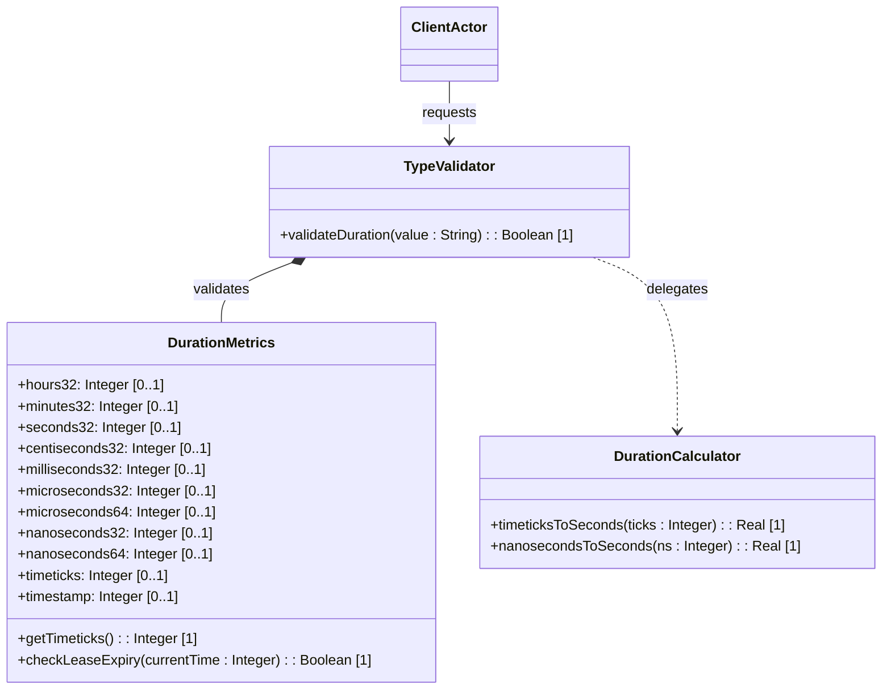

# Feature: Duration and Measurement Units

## Description
This feature provides duration measurement definitions and high-resolution time intervals (hours32, minutes32, seconds32, centiseconds32, milliseconds32, microseconds32, microseconds64, nanoseconds32, nanoseconds64, timeticks, timestamp), supporting calculations and metric derivations.

## UML Class Diagram


## Functional UI Requirements
### 1. Test Data Shape (JSON Payload Example)
```json
{
  "hours32": 24,
  "minutes32": 1440,
  "seconds32": 86400,
  "centiseconds32": 8640000,
  "milliseconds32": 86400000,
  "microseconds32": 2147483647,
  "microseconds64": 86400000000,
  "nanoseconds32": 2147483647,
  "nanoseconds64": 86400000000000,
  "timeticks": 10000,
  "timestamp": 12000
}
```

### 2. Validation & Constraints
- `hours32`, `minutes32`, `seconds32`, `centiseconds32`, `milliseconds32`, `microseconds32`, `nanoseconds32`: Signed 32-bit Integer durations. Range: `[-2147483648, 2147483647]`.
- `microseconds64`, `nanoseconds64`: Signed 64-bit Integer durations. Range: `[-9223372036854775808, 9223372036854775807]`.
- `timeticks`: Unsigned 32-bit integer representing time in hundredths of a second.
- `timestamp`: Unsigned 32-bit integer derived from `timeticks` representing when an event occurred.

### 3. Visual Layout & Arrangement
- **Duration Panel Grid**:
  - Horizontal list of durations: hours, minutes, seconds, milliseconds, microseconds, nanoseconds.
  - Sub-section for "Timeticks and Timestamps" displaying counter values and time equivalents (e.g. `100.00 seconds`).
- **Calculator Box**: Visual component showing the conversion process (e.g., converting 10,000 timeticks to 100 seconds).

### 4. Interactive Flow & States
- **Duration Configuration**: Input fields allow numeric inputs with range indicators. Exceeding the 32-bit or 64-bit limit highlights fields in red.
- **Conversion Trigger**: Changing a timeticks value triggers the calculator component, displaying the derived seconds value.

## Code Realization Table
| Feature/Attribute | Source File | Class/Type | Function/Method | Notes |
|---|---|---|---|---|
| hours32 | yang/ietf-yang-types.yang | DurationMetrics | hours32 | Signed 32-bit integer |
| minutes32 | yang/ietf-yang-types.yang | DurationMetrics | minutes32 | Signed 32-bit integer |
| seconds32 | yang/ietf-yang-types.yang | DurationMetrics | seconds32 | Signed 32-bit integer |
| centiseconds32 | yang/ietf-yang-types.yang | DurationMetrics | centiseconds32 | Signed 32-bit integer |
| milliseconds32 | yang/ietf-yang-types.yang | DurationMetrics | milliseconds32 | Signed 32-bit integer |
| microseconds32 | yang/ietf-yang-types.yang | DurationMetrics | microseconds32 | Signed 32-bit integer |
| microseconds64 | yang/ietf-yang-types.yang | DurationMetrics | microseconds64 | Signed 64-bit integer |
| nanoseconds32 | yang/ietf-yang-types.yang | DurationMetrics | nanoseconds32 | Signed 32-bit integer |
| nanoseconds64 | yang/ietf-yang-types.yang | DurationMetrics | nanoseconds64 | Signed 64-bit integer |
| timeticks | yang/ietf-yang-types.yang | DurationMetrics | timeticks | Modulo 2^32, 1/100s |
| timestamp | yang/ietf-yang-types.yang | DurationMetrics | timestamp | Reference event time |

## Given-When-Then Acceptance Criteria
### Scenario: Converting Timeticks to Seconds
Given a timeticks value of 10000 (representing 100 seconds)
When the system calculates the duration in seconds
Then the derived seconds value is computed as 100.0

### Scenario: Duration Range Validation Limit
Given a nanoseconds32 input field
When the user submits a value of 3000000000 (exceeding 2147483647)
Then the system rejects the value with a range validation error

### Scenario: Negative Microseconds64 Duration
Given a countdown timer
When the system receives a negative value of -60000000 (representing -60 seconds)
Then the system accepts the value as a valid duration representation

## Specification Context (Verbatim)
```text
   The timeticks type represents a non-negative integer that
   represents the time, modulo 2^32, in hundredths of a second
   between two epochs.
```

## 4. Source References
Structural Schema: [ietf-yang-types.yang](https://github.com/YangModels/yang/blob/main/standard/ietf/RFC/ietf-yang-types%402025-12-22.yang)
Normative Specification: [RFC 9911 Section 4](https://datatracker.ietf.org/doc/rfc9911/)
