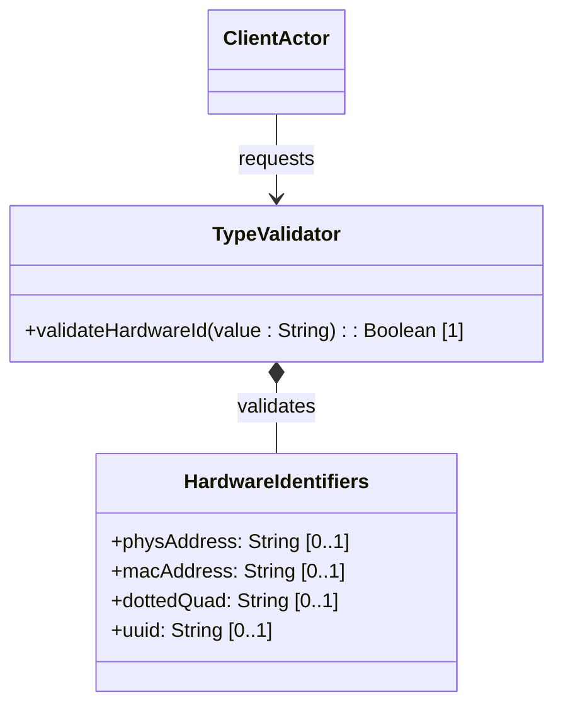

# Feature: Network and Hardware Identifier Types

## Description
This feature provides validation and schema constraint checking for standard hardware and network identifiers (phys-address, mac-address, dotted-quad, uuid) used in device management.

## UML Class Diagram


## Functional UI Requirements
### 1. Test Data Shape (JSON Payload Example)
```json
{
  "phys-address": "00:11:22:33:44:55:66:77",
  "mac-address": "00:11:22:33:44:55",
  "dotted-quad": "192.0.2.1",
  "uuid": "f81d4fae-7dec-11d0-a765-00a0c91e6bf6"
}
```

### 2. Validation & Constraints
- `phys-address`: String containing hex octets separated by colons (representing a physical media address). Regex pattern: `([0-9a-fA-F]{2}(:[0-9a-fA-F]{2})*)?`.
- `mac-address`: MAC address in canonical format (`00:11:22:33:44:55`). Regex pattern: `[0-9a-fA-F]{2}(:[0-9a-fA-F]{2}){5}`.
- `dotted-quad`: IPv4 style dotted quad address. Regex pattern: `(([0-9]|[1-9][0-9]|1[0-9][0-9]|2[0-4][0-9]|25[0-5])\.){3}([0-9]|[1-9][0-9]|1[0-9][0-9]|2[0-4][0-9]|25[0-5])`.
- `uuid`: Universally Unique Identifier in canonical hexadecimal representation (RFC 4122). Regex pattern: `[0-9a-fA-F]{8}-[0-9a-fA-F]{4}-[0-9a-fA-F]{4}-[0-9a-fA-F]{4}-[0-9a-fA-F]{12}`.

### 3. Visual Layout & Arrangement
- **Hardware Identifiers Section**: Form layout grouping hardware fields.
- **Dotted Quad Input**: Single text field with helper placeholder `192.0.2.1`.
- **MAC Address Input**: Formatted field dividing 6 octets or parsing colon-delimited inputs.
- **UUID Field**: Display-only field with a copy-to-clipboard button and a "Generate UUID" action.

### 4. Interactive Flow & States
- **Format Auto-Correction**: Typing MAC address characters without colons automatically inserts colons at 2-character boundaries.
- **Validation State**: Violating pattern constraints highlights fields in red with message "Invalid physical address format" or "Invalid UUID format".

## Code Realization Table
| Feature/Attribute | Source File | Class/Type | Function/Method | Notes |
|---|---|---|---|---|
| phys-address | yang/ietf-yang-types.yang | HardwareIdentifiers | physAddress | Colon separated hex string |
| mac-address | yang/ietf-yang-types.yang | HardwareIdentifiers | macAddress | Exactly 6 hex octets |
| dotted-quad | yang/ietf-yang-types.yang | HardwareIdentifiers | dottedQuad | IPv4 dotted decimal |
| uuid | yang/ietf-yang-types.yang | HardwareIdentifiers | uuid | Canonical 36-char string |

## Given-When-Then Acceptance Criteria
### Scenario: Valid MAC Address Validation
Given a client enters a MAC address
When the value is "00:11:22:33:44:55"
Then the system validates the string successfully against the mac-address pattern

### Scenario: Invalid UUID Character Input
Given a UUID input field
When the user inputs "g81d4fae-7dec-11d0-a765-00a0c91e6bf6" (containing invalid 'g' character)
Then the system rejects the input with a validation error

### Scenario: Valid Dotted Quad IPv4
Given a dotted-quad input field
When the value is "192.0.2.255"
Then the system accepts the value as a valid dotted-quad representation

## Specification Context (Verbatim)
```text
   The mac-address type represents a MAC address in canonical,
   symmetric form: 6 octets represented in hexadecimal, separated
   by colons.
```

## 4. Source References
Structural Schema: [ietf-yang-types.yang](https://github.com/YangModels/yang/blob/main/standard/ietf/RFC/ietf-yang-types%402025-12-22.yang)
Normative Specification: [RFC 9911 Section 3](https://datatracker.ietf.org/doc/rfc9911/)
