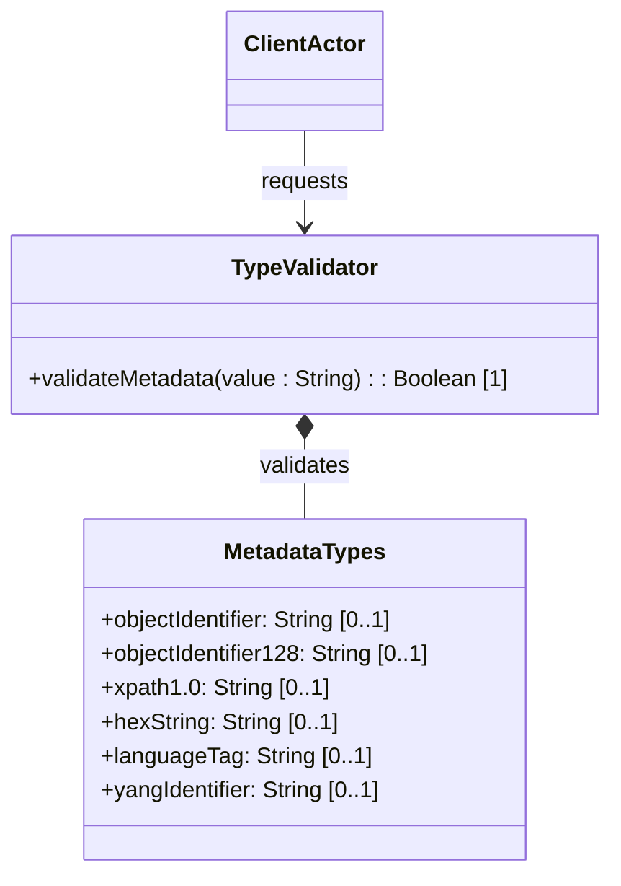

# Feature: Metadata and Language Tag Types

## Description
This feature provides validation and schema checks for standard metadata descriptors, schema identifiers, and language tags (object-identifier, object-identifier-128, xpath1.0, hex-string, language-tag, yang-identifier).

## UML Class Diagram


## Functional UI Requirements
### 1. Test Data Shape (JSON Payload Example)
```json
{
  "object-identifier": "1.3.6.1.2.1.1.1",
  "object-identifier-128": "1.3.6.1.2.1.1.1",
  "xpath1.0": "/system/services",
  "hex-string": "00:ff:12:34",
  "language-tag": "en-US",
  "yang-identifier": "ietf_geo_location"
}
```

### 2. Validation & Constraints
- `object-identifier`: Standard SMIv2 Object Identifier (OID) dot-separated decimal integers. Pattern: `(([0-1](\.[1-3]?[0-9]))|(2\.(0|([1-9]\d*))))(\.(0|([1-9]\d*)))*`.
- `object-identifier-128`: OID restricted to a maximum length of 128 sub-identifiers.
- `xpath1.0`: XPath 1.0 expression string.
- `hex-string`: Hexadecimal bytes separated by colons. Pattern: `([0-9a-fA-F]{2}(:[0-9a-fA-F]{2})*)?`.
- `language-tag`: Language tag according to RFC 5646.
- `yang-identifier`: YANG identifier string according to YANG 1.1 rules. Pattern: `[a-zA-Z_][a-zA-Z0-9_\-.]*`.

### 3. Visual Layout & Arrangement
- **Metadata Fields Section**: Structured form groupings.
- **Language Selector Dropdown**: Automatically generates RFC 5646 language tags when user selects a language/region name (e.g. English - United States).
- **YANG Identifier field**: Text input with real-time character filter enforcing only alphanumeric, dots, dashes, and underscores starting with a letter/underscore.

### 4. Interactive Flow & States
- **OID Syntax Assistance**: Typing OID digits dynamically validates that sub-identifiers start with valid standard roots (e.g. 1.3.6.1).
- **Validation Warnings**: Highlights invalid OID structures or language-tag formats in real-time.

## Code Realization Table
| Feature/Attribute | Source File | Class/Type | Function/Method | Notes |
|---|---|---|---|---|
| object-identifier | yang/ietf-yang-types.yang | MetadataTypes | objectIdentifier | OID dot notation |
| object-identifier-128 | yang/ietf-yang-types.yang | MetadataTypes | objectIdentifier128 | OID restricted to 128 |
| xpath1.0 | yang/ietf-yang-types.yang | MetadataTypes | xpath1.0 | XPath 1.0 string |
| hex-string | yang/ietf-yang-types.yang | MetadataTypes | hexString | Hex bytes with colons |
| language-tag | yang/ietf-yang-types.yang | MetadataTypes | languageTag | RFC 5646 language tags |
| yang-identifier | yang/ietf-yang-types.yang | MetadataTypes | yangIdentifier | Aligned with YANG 1.1 |

## Given-When-Then Acceptance Criteria
### Scenario: Validating OID Format
Given an object-identifier input field
When the client enters "1.3.6.1.2.1"
Then the system accepts the OID value successfully

### Scenario: Validating YANG Identifier with Leading Digit
Given a yang-identifier input field
When the user enters "99-metric-name" (starting with digit)
Then the system rejects the input with a validation error indicating identifier cannot start with a digit

### Scenario: Validating RFC 5646 Language Tag
Given a language-tag input field
When the value is "en-US"
Then the system accepts the language tag successfully

## Specification Context (Verbatim)
```text
   The yang-identifier type represents a YANG identifier string.
   The yang-identifier definition has been aligned with YANG 1.1.
```

## 4. Source References
Structural Schema: [ietf-yang-types.yang](https://github.com/YangModels/yang/blob/main/standard/ietf/RFC/ietf-yang-types%402025-12-22.yang)
Normative Specification: [RFC 9911 Section 3](https://datatracker.ietf.org/doc/rfc9911/)
