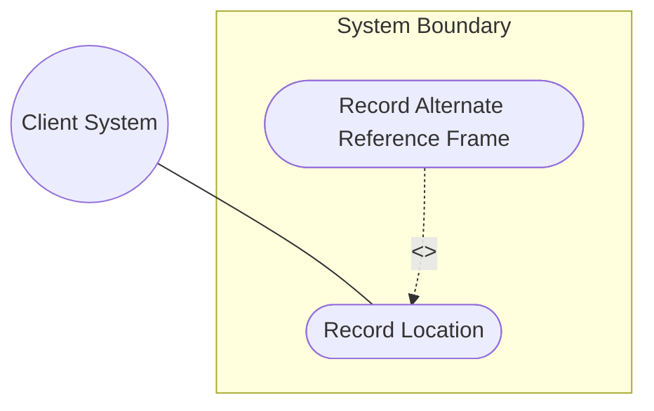
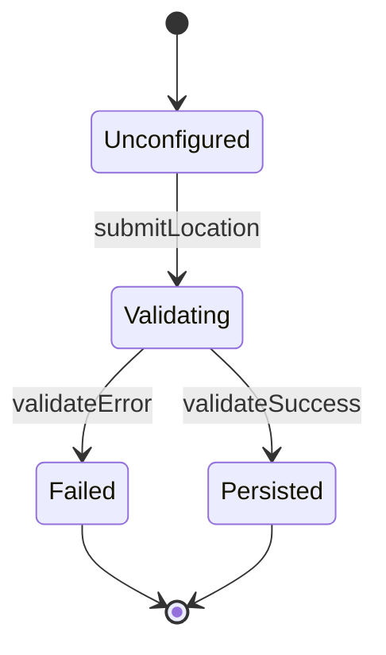

# Use Case: Record Geographic Location

## 1. Actors
- **Primary Actor:** Client System
- **Secondary Actors:** Geodetic Reference Database

## 2. Preconditions
- The location service is initialized and online.
- The reference frame registry is loaded with valid astronomical bodies and geodetic systems.

## 3. Trigger
The Client System sends a request to record a geographic location.

## 4. Main Success Scenario (Basic Flow)
1. Client System submits a geographic location configuration payload.
2. System extracts the reference-frame properties (astronomical-body, geodetic-datum).
3. System verifies the geodetic reference datum is valid on the astronomical body.
4. System parses the coordinates choice (ellipsoidal latitude/longitude or Cartesian X/Y/Z).
5. System validates coordinates against the datum bounds.
6. System persists the location record with the current timestamp.

## 5. Alternate and Exception Flows
- **5a. Alternate Reference Frame (Branches from Basic Flow step 2):**
  1. System detects an alternate-system attribute in the reference frame.
  2. System validates alternate-system support.
  3. System retrieves coordinate system definitions from Geodetic Reference Database and returns to step 3.
- **5b. Invalid Coordinate Value (Branches from Basic Flow step 5):**
  1. System detects latitude or longitude coordinate exceeds geodetic limits.
  2. System aborts the transaction, rolls back any modifications, and returns a validation error.

## 6. Postconditions (Guarantees)
- **Success Guarantee:** The geographic location coordinate record is validated and saved in the database.
- **Failure Guarantee:** The system state is rolled back, no record is saved, and a detailed validation error is returned.

## UML Diagrams
### Use Case Diagram


### State Machine Diagram


## 7. Operational Context
```text
   The geo-location container object specifies a location on or around
   an astronomical object. The grouping is designed to be imported by
   other modules representing network topology elements or physical
   assets.
```

## 8. Realization Matrix
### Required User Stories
- [ ] #6 - [User Story: Record Ellipsoidal Geographic Location](https://github.com/gintatkinson/digipipe-tst20/blob/main/docs/user-stories/us-01-ellipsoidal-location.md) (realizes ellipsoidal coordinates submission)
- [ ] #7 - [User Story: Record Cartesian Geographic Location](https://github.com/gintatkinson/digipipe-tst20/blob/main/docs/user-stories/us-02-cartesian-location.md) (realizes Cartesian coordinates submission)

### Required Features
- [ ] #1 - [Feature: Reference Frame Configuration](https://github.com/gintatkinson/digipipe-tst20/blob/main/docs/features/feat-01-reference-frame.md) (provides reference frame parsing)
- [ ] #2 - [Feature: Spatial Coordinate Representation](https://github.com/gintatkinson/digipipe-tst20/blob/main/docs/features/feat-02-spatial-coordinates.md) (provides ellipsoidal and Cartesian coordinate types)

## Source References
Structural Schema: [ietf-geo-location.yang](https://github.com/YangModels/yang/blob/main/standard/ietf/RFC/ietf-geo-location%402022-02-11.yang)
Normative Specification: [RFC 9179](https://datatracker.ietf.org/doc/rfc9179/)
