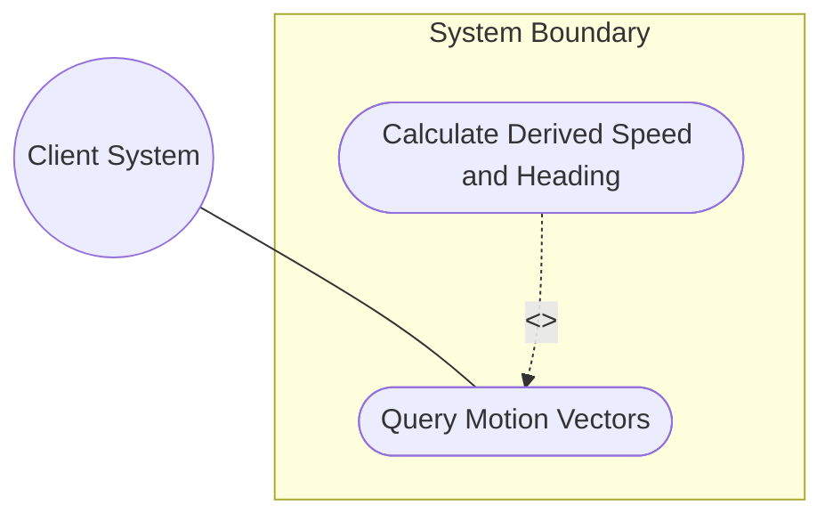
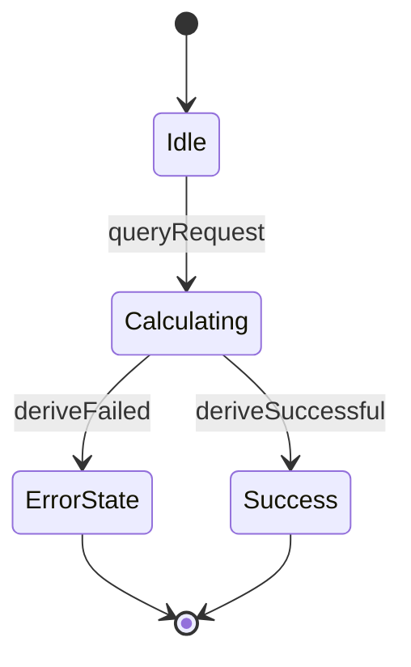

# Use Case: Query Motion Vectors and Derive Speed and Heading

## 1. Actors
- **Primary Actor:** Client System
- **Secondary Actors:** Motion Service Engine

## 2. Preconditions
- The geographic location record has velocity vector attributes configured.
- The motion engine utility is operational.

## 3. Trigger
The Client System queries the motion parameters or requests speed and heading calculation.

## 4. Main Success Scenario (Basic Flow)
1. Client System requests motion statistics for a location record.
2. System retrieves velocity vector components (v-north, v-east, v-up).
3. System invokes the motion calculator component.
4. System computes speed using Euclidean norm of horizontal velocity.
5. System computes heading using arctangent of east-north ratio.
6. System returns the velocity vector and derived speed/heading values.

## 5. Alternate and Exception Flows
- **5a. Division by Zero Protection (Branches from Basic Flow step 5):**
  1. System detects v-north is 0.0 (which would cause division by zero in arctan).
  2. System checks the value of v-east.
  3. System assigns a heading of 90.0 degrees (if v-east > 0) or 270.0 degrees (if v-east < 0) and resumes basic flow.
- **5b. Missing Velocity Components (Branches from Basic Flow step 2):**
  1. System detects that one or more velocity components (v-north, v-east) are unconfigured.
  2. System aborts calculation, reverts derived values, and returns a warning code.

## 6. Postconditions (Guarantees)
- **Success Guarantee:** Motion statistics and calculated speed/heading values are successfully returned to the client.
- **Failure Guarantee:** Calculation is aborted, no derived values are returned, and a detailed calculation error is returned.

## UML Diagrams
### Use Case Diagram


### State Machine Diagram


## 7. Operational Context
```text
   For objects in relatively stable motion, the grouping provides a three-
   dimensional vector value (v-north, v-east, v-up) used to calculate
   two-dimensional speed and heading.
```

## 8. Realization Matrix
### Required User Stories
- [ ] #8 - [User Story: Derive Motion Speed and Heading from Velocity Vectors](https://github.com/gintatkinson/digipipe-tst20/blob/main/docs/user-stories/us-03-motion-derivation.md) (realizes the math derivation sequence)

### Required Features
- [ ] #3 - [Feature: Velocity and Motion Profile](https://github.com/gintatkinson/digipipe-tst20/blob/main/docs/features/feat-03-velocity-motion.md) (provides velocity v-north and v-east attributes)

## Source References
Structural Schema: [ietf-geo-location.yang](https://github.com/YangModels/yang/blob/main/standard/ietf/RFC/ietf-geo-location%402022-02-11.yang)
Normative Specification: [RFC 9179 Section 2.3](https://datatracker.ietf.org/doc/rfc9179/)
