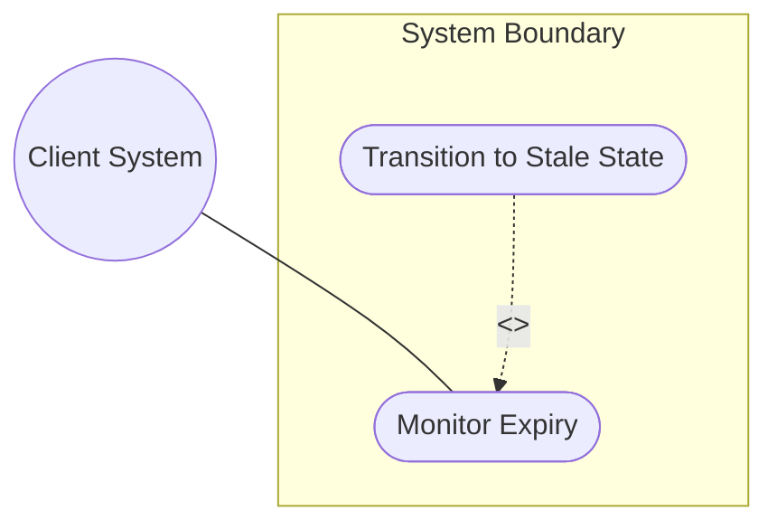
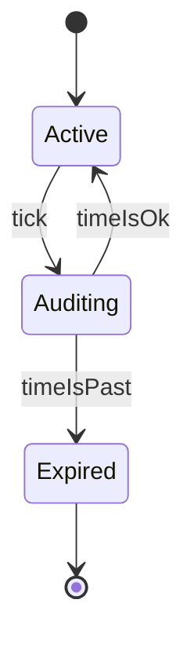

# Use Case: Monitor Location Validity and Handle Expiry

## 1. Actors
- **Primary Actor:** Client System
- **Secondary Actors:** Clock Daemon

## 2. Preconditions
- The location record has a valid-until expiration timestamp configured.
- The clock service is synchronized.

## 3. Trigger
The Clock Daemon triggers a periodic evaluation or a client attempts to retrieve the location coordinate.

## 4. Main Success Scenario (Basic Flow)
1. System receives a request to read the location coordinate or triggers periodic validation.
2. System fetches the valid-until attribute of the record.
3. System checks current system time against the valid-until timestamp.
4. System determines the record has not expired.
5. System returns the active location details to the Client System.

## 5. Alternate and Exception Flows
- **5a. Expiration Triggered (Branches from Basic Flow step 4):**
  1. System determines current system time is past the valid-until timestamp.
  2. System transitions the location record state to Stale/Expired.
  3. System logs the expiration state change and returns an expired state indicator.
- **5b. Omitted Expiry Check (Branches from Basic Flow step 2):**
  1. System detects the valid-until attribute is omitted/null.
  2. System classifies the record as permanently active and skips the chronological validation check.

## 6. Postconditions (Guarantees)
- **Success Guarantee:** The record validity is audited and stale coordinates are transitioned to expired status.
- **Failure Guarantee:** Auditing is aborted, the state is unmodified, and an alert is logged.

## UML Diagrams
### Use Case Diagram


### State Machine Diagram


## 7. Operational Context
```text
   valid-until is the timestamp for which this geo-location is valid
   until. If unspecified, the geo-location has no specific expiration
   time.
```

## 8. Realization Matrix
### Required User Stories
- [ ] #9 - [User Story: Monitor Record Validity and Transition Stale Location State](https://github.com/gintatkinson/digipipe-tst20/blob/main/docs/user-stories/us-04-lifecycle-expiration.md) (realizes validity checking sequence)

### Required Features
- [ ] #4 - [Feature: Temporal and Validity Attributes](https://github.com/gintatkinson/digipipe-tst20/blob/main/docs/features/feat-04-temporal-validity.md) (provides timestamp and valid-until attributes)

## Source References
Structural Schema: [ietf-geo-location.yang](https://github.com/YangModels/yang/blob/main/standard/ietf/RFC/ietf-geo-location%402022-02-11.yang)
Normative Specification: [RFC 9179 Section 2.7](https://datatracker.ietf.org/doc/rfc9179/)
