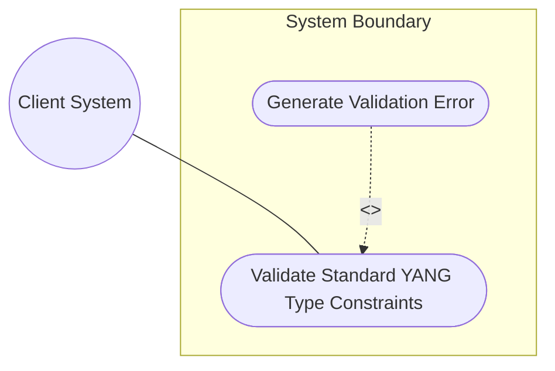
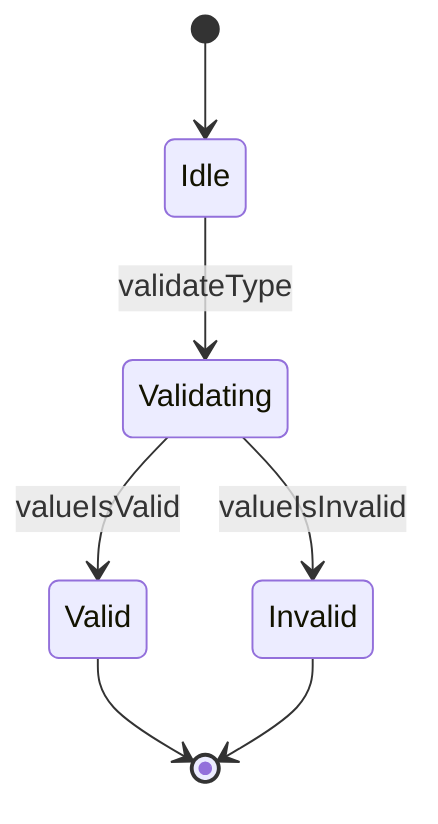

# Use Case: Validate Standard YANG Type Constraints

## 1. Actors
- **Primary Actor:** Client System
- **Secondary Actors:** Validator Service

## 2. Preconditions
- The YANG data schemas are loaded and active in the system.
- The input value and target YANG data type name are supplied.

## 3. Trigger
The Client System submits an input value to validate against a target standard YANG data type.

## 4. Main Success Scenario (Basic Flow)
1. System receives a request containing the input value and target YANG type name.
2. System retrieves the validation rules and regex patterns associated with the type name.
3. System executes pattern, bounds, or length checks on the input value.
4. System determines that the input value conforms to all schema requirements.
5. System returns a validation success response to the Client System.

## 5. Alternate and Exception Flows
- **5a. Validation Fails (Branches from Basic Flow step 4):**
  1. System determines the input value does not conform to pattern, length, or range constraints.
  2. System flags the constraint violation, generates a detailed validation error, and returns a failure response.
- **5b. Unsupported Type Name (Branches from Basic Flow step 2):**
  1. System determines that the requested type name is not registered or supported.
  2. System aborts the verification flow, logs an unsupported type warning, and returns a failure response.

## 6. Postconditions (Guarantees)
- **Success Guarantee:** The input value is verified as schema-conformant, allowing it to be parsed and stored safely.
- **Failure Guarantee:** The invalid input is rejected, preventing schema contamination, and a detailed validation error is returned.

## UML Diagrams
### Use Case Diagram


### State Machine Diagram


## 7. Operational Context
```text
   The date-and-time type represents a date and time value.
   The representation of time zone offsets has been aligned with RFC 9557,
   and types representing time support the representation of leap seconds.
```

## 8. Realization Matrix
### Required User Stories
- [ ] #19 - [User Story: Validate Hardware and Network Identifiers](https://github.com/gintatkinson/digipipe-tst20/blob/main/docs/user-stories/us-05-validate-identifiers.md) (implements identifier format verification)

### Required Features
- [ ] #14 - [Feature: Date and Time Types](https://github.com/gintatkinson/digipipe-tst20/blob/main/docs/features/feat-06-date-time.md) (provides date-time structures and leap-second validation)
- [ ] #16 - [Feature: Network and Hardware Identifier Types](https://github.com/gintatkinson/digipipe-tst20/blob/main/docs/features/feat-08-hardware-identifiers.md) (provides MAC/UUID/IP format validation)
- [ ] #17 - [Feature: Metadata and Language Tag Types](https://github.com/gintatkinson/digipipe-tst20/blob/main/docs/features/feat-09-metadata-language.md) (provides language tag and OID/XPath validation)

## Source References
Structural Schema: [ietf-yang-types.yang](https://github.com/YangModels/yang/blob/main/standard/ietf/RFC/ietf-yang-types%402025-12-22.yang)
Normative Specification: [RFC 9911 Section 3](https://datatracker.ietf.org/doc/rfc9911/)
