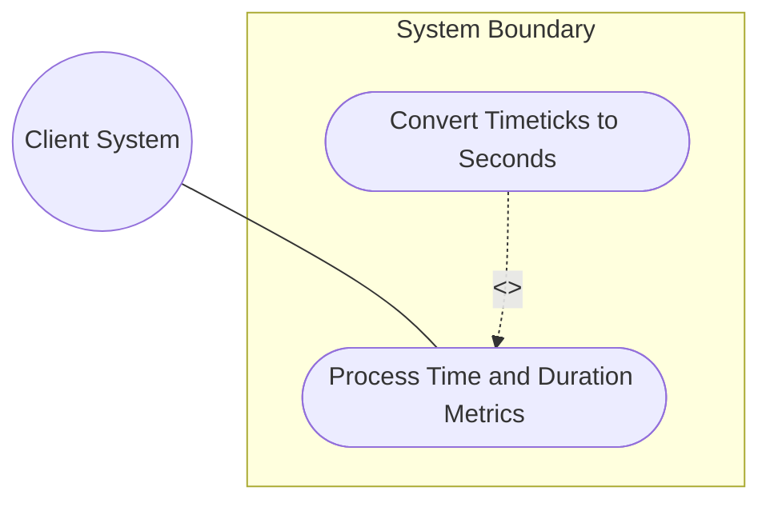
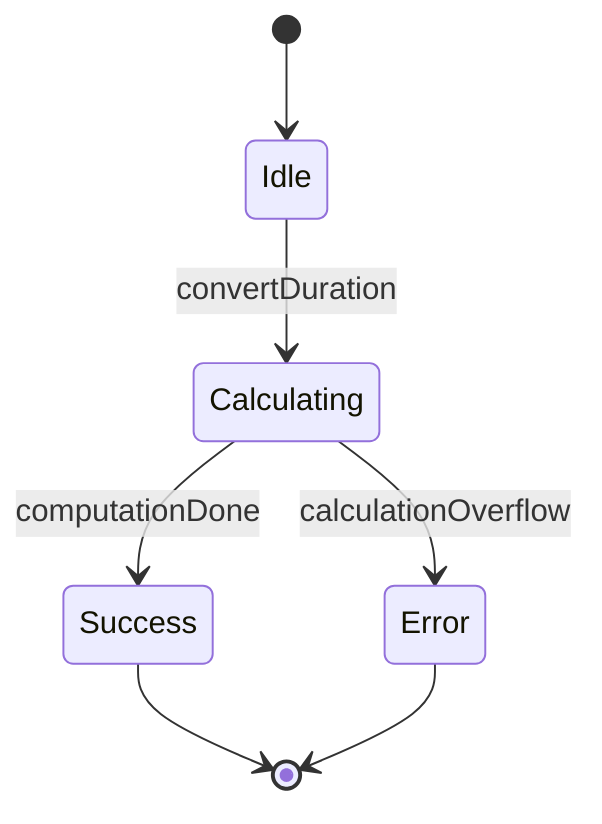

# Use Case: Process Time and Duration Metrics

## 1. Actors
- **Primary Actor:** Client System
- **Secondary Actors:** Duration Calculator

## 2. Preconditions
- The target duration metric (e.g. timeticks, nanoseconds) is initialized.
- The system is ready to process numeric conversions.

## 3. Trigger
The Client System requests the conversion of a raw duration metric to standard seconds.

## 4. Main Success Scenario (Basic Flow)
1. System receives a request to convert a raw duration (e.g., timeticks) to seconds.
2. System loads the raw duration value from the metrics store.
3. System invokes the Duration Calculator component.
4. Duration Calculator computes the seconds equivalent (e.g., dividing timeticks by 100).
5. System returns the computed seconds value to the Client System.

## 5. Alternate and Exception Flows
- **5a. Calculation Bounds Overflow (Branches from Basic Flow step 4):**
  1. System detects that the input value or computation result exceeds the representable range (e.g. 32-bit integer overflow).
  2. System flags the calculation error, aborts the conversion, and returns an out-of-bounds error.
- **5b. Null Metric Value (Branches from Basic Flow step 2):**
  1. System detects that the requested duration metric is null/empty.
  2. System aborts the computation, returns a default zero value, and logs a warning.

## 6. Postconditions (Guarantees)
- **Success Guarantee:** The duration is accurately converted to seconds and returned, preserving high-resolution detail.
- **Failure Guarantee:** The system aborts the calculation, leaves the metric store unmodified, and returns a detailed numeric error.

## UML Diagrams
### Use Case Diagram


### State Machine Diagram


## 7. Operational Context
```text
   The timeticks type represents a non-negative integer that
   represents the time, modulo 2^32, in hundredths of a second
   between two epochs.
```

## 8. Realization Matrix
### Required User Stories
- [ ] #21 - [User Story: Convert Timeticks and High-Resolution Durations](https://github.com/gintatkinson/digipipe-tst20/blob/main/docs/user-stories/us-07-duration-conversion.md) (implements timeticks to seconds conversion logic)
- [ ] #20 - [User Story: Monitor Gauge Thresholds and Wrap Counters](https://github.com/gintatkinson/digipipe-tst20/blob/main/docs/user-stories/us-06-monitor-gauges.md) (implements range/boundary checks on counter/gauge metrics)

### Required Features
- [ ] #13 - [Feature: Numeric Metric Types](https://github.com/gintatkinson/digipipe-tst20/blob/main/docs/features/feat-05-numeric-metrics.md) (provides gauge/counter ranges and limits)
- [ ] #15 - [Feature: Duration and Measurement Units](https://github.com/gintatkinson/digipipe-tst20/blob/main/docs/features/feat-07-duration-measurement.md) (provides timeticks, nanoseconds, and DurationCalculator class definition)

## Source References
Structural Schema: [ietf-yang-types.yang](https://github.com/YangModels/yang/blob/main/standard/ietf/RFC/ietf-yang-types%402025-12-22.yang)
Normative Specification: [RFC 9911 Section 4](https://datatracker.ietf.org/doc/rfc9911/)
