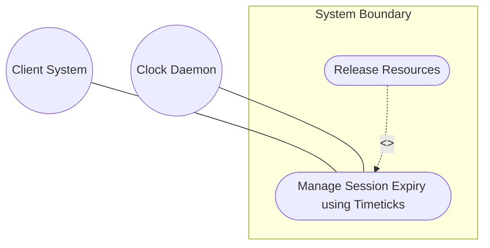
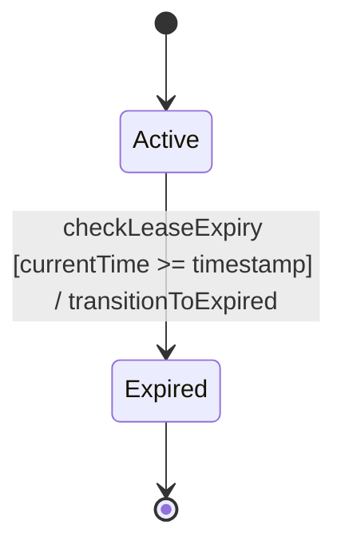

# Use Case: Manage Session Expiry using Timeticks

## 1. Actors
- **Primary Actor:** Client System
- **Secondary Actors:** Clock Daemon

## 2. Preconditions
- A resource lease is active and associated with a timeticks/timestamp limit.
- The Clock Daemon is synchronized.

## 3. Trigger
The Clock Daemon triggers a periodic evaluation, or a Client System attempts to access the leased resource.

## 4. Main Success Scenario (Basic Flow)
1. System receives a request to access the leased resource.
2. System retrieves the current time and the lease expiration timestamp.
3. System verifies that the current time has not exceeded the expiration timestamp.
4. System permits access to the leased resource.
5. System returns the resource details to the Client System.

## 5. Alternate and Exception Flows
- **5a. Lease Expiry Transition (Branches from Basic Flow step 3):**
  1. System determines the current time is greater than or equal to the expiration timestamp.
  2. System transitions the lease state from Active to Expired.
  3. System terminates active sessions associated with the lease, releases allocated resources, and returns an Expired status.
- **5b. Temporal Sync Loss (Branches from Basic Flow step 2):**
  1. System detects that synchronization with the clock source is lost.
  2. System logs a warning alert, suspends automatic state transitions, and continues permitting access under the last known valid state.

## 6. Postconditions (Guarantees)
- **Success Guarantee:** The lease state is audited, and expired resource leases are automatically terminated and reclaimed.
- **Failure Guarantee:** Auditing is aborted, current lease states are preserved, and a temporal synchronization alarm is raised.

## UML Diagrams
### Use Case Diagram


### State Machine Diagram


## 7. Operational Context
```text
   The timeticks type represents a non-negative integer that
   represents the time, modulo 2^32, in hundredths of a second
   between two epochs.
```

## 8. Realization Matrix
### Required User Stories
- [ ] #22 - [User Story: Evaluate Lease Validity and Timeout Expirations](https://github.com/gintatkinson/digipipe-tst20/blob/main/docs/user-stories/us-08-lease-expiration.md) (implements lease validity sequence and state transition)

### Required Features
- [ ] #15 - [Feature: Duration and Measurement Units](https://github.com/gintatkinson/digipipe-tst20/blob/main/docs/features/feat-07-duration-measurement.md) (provides timeticks and timestamp attributes)

## Source References
Structural Schema: [ietf-yang-types.yang](https://github.com/YangModels/yang/blob/main/standard/ietf/RFC/ietf-yang-types%402025-12-22.yang)
Normative Specification: [RFC 9911 Section 4](https://datatracker.ietf.org/doc/rfc9911/)
