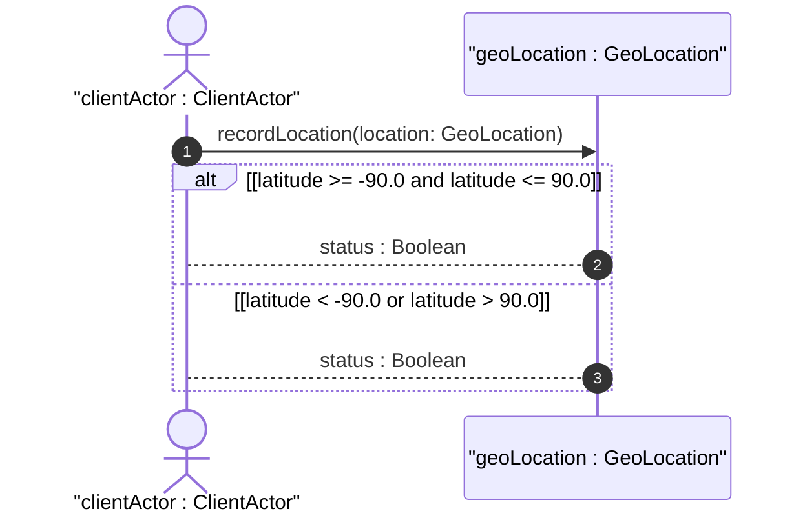

# User Story: Record Ellipsoidal Geographic Location

## Domain Object Mapping
- **Primary Domain Objects:** `GeoLocation`, `ReferenceFrame`, `GeodeticSystem`, `Ellipsoid`
- **Actor/Role:** `clientActor : ClientActor`

## BDD Scenario (OOA/OOD Realization)
**Given** the system is configured with a valid reference frame
**When** the client submits ellipsoidal coordinates with a latitude of 37.7749 and longitude of -122.4194
**Then** the system validates the coordinates against the geodetic reference frame bounds
And stores the geographic location record successfully

## UML Sequence Diagram


## Operational Context
```text
   The ellipsoid case defines the latitude, longitude, and height
   values. The latitude and longitude are represented in decimal
   degrees, and height is in meters.
```

## Required Features Matrix
- [ ] #1 - [Feature: Reference Frame Configuration](https://github.com/gintatkinson/digipipe-tst20/blob/main/docs/features/feat-01-reference-frame.md) (provides reference frame and astronomical body definition)
- [ ] #2 - [Feature: Spatial Coordinate Representation](https://github.com/gintatkinson/digipipe-tst20/blob/main/docs/features/feat-02-spatial-coordinates.md) (provides ellipsoidal case latitude and longitude definitions)

## Source References
Structural Schema: [ietf-geo-location.yang](https://github.com/YangModels/yang/blob/main/standard/ietf/RFC/ietf-geo-location%402022-02-11.yang)
Normative Specification: [RFC 9179 Section 2.2](https://datatracker.ietf.org/doc/rfc9179/)
