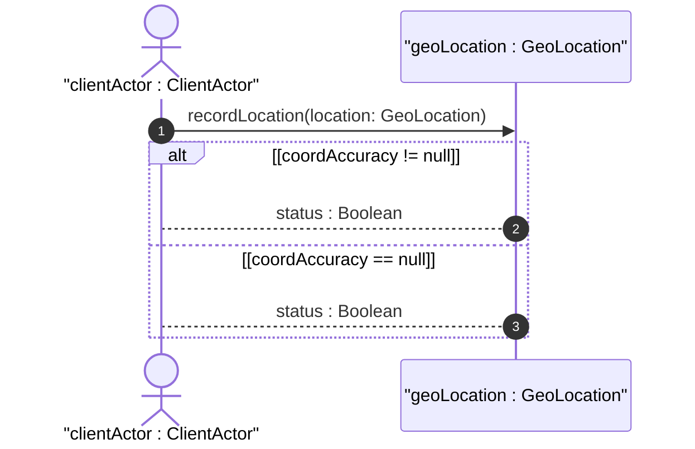

# User Story: Record Cartesian Geographic Location

## Domain Object Mapping
- **Primary Domain Objects:** `GeoLocation`, `ReferenceFrame`, `GeodeticSystem`, `Cartesian`
- **Actor/Role:** `clientActor : ClientActor`

## BDD Scenario (OOA/OOD Realization)
**Given** the reference frame supports Cartesian coordinates
**When** the client submits Cartesian coordinates (X: 6378137, Y: 0, Z: 0)
**Then** the system validates the coordinates against the Cartesian reference frame
And stores the geographic location record successfully

## UML Sequence Diagram


## Operational Context
```text
   The cartesian case defines the X, Y, and Z coordinate values in
   meters, which are modeled relative to the geocentric system.
```

## Required Features Matrix
- [ ] #1 - [Feature: Reference Frame Configuration](https://github.com/gintatkinson/digipipe-tst20/blob/main/docs/features/feat-01-reference-frame.md) (provides reference frame and geodetic system definitions)
- [ ] #2 - [Feature: Spatial Coordinate Representation](https://github.com/gintatkinson/digipipe-tst20/blob/main/docs/features/feat-02-spatial-coordinates.md) (provides Cartesian case X, Y, and Z attribute definitions)

## Source References
Structural Schema: [ietf-geo-location.yang](https://github.com/YangModels/yang/blob/main/standard/ietf/RFC/ietf-geo-location%402022-02-11.yang)
Normative Specification: [RFC 9179 Section 2.2](https://datatracker.ietf.org/doc/rfc9179/)
