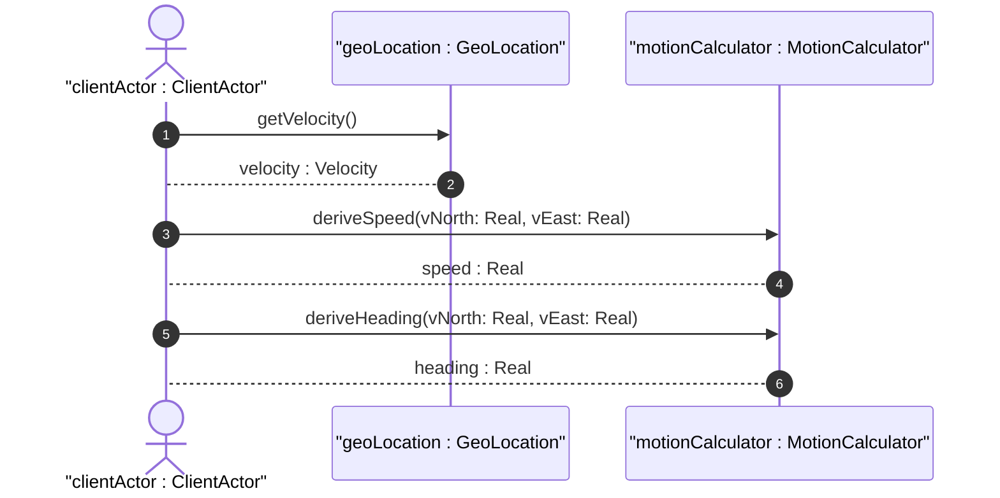

# User Story: Derive Motion Speed and Heading from Velocity Vectors

## Domain Object Mapping
- **Primary Domain Objects:** `GeoLocation`, `Velocity`, `MotionCalculator`
- **Actor/Role:** `clientActor : ClientActor`

## BDD Scenario (OOA/OOD Realization)
**Given** an object has a velocity vector with v-north and v-east attributes
**When** the system calculates derived motion metrics
**Then** the speed is computed as the square root of the sum of squares of v-north and v-east
And the heading is computed as the arctangent of v-east divided by v-north

## UML Sequence Diagram


## Operational Context
```text
    To derive the two-dimensional heading and speed, one would use the
    following formulas:

                  ,------------------------------
        speed =  V  v_{north}^{2} + v_{east}^{2}

        heading = arctan(v_{east} / v_{north})
```

## Required Features Matrix
- [ ] #3 - [Feature: Velocity and Motion Profile](https://github.com/gintatkinson/digipipe-tst20/blob/main/docs/features/feat-03-velocity-motion.md) (defines velocity vectors v-north, v-east, v-up)

## Source References
Structural Schema: [ietf-geo-location.yang](https://github.com/YangModels/yang/blob/main/standard/ietf/RFC/ietf-geo-location%402022-02-11.yang)
Normative Specification: [RFC 9179 Section 2.3](https://datatracker.ietf.org/doc/rfc9179/)
