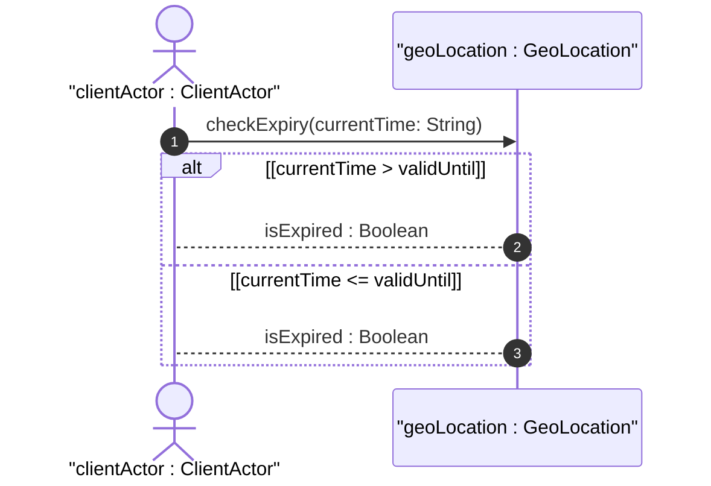
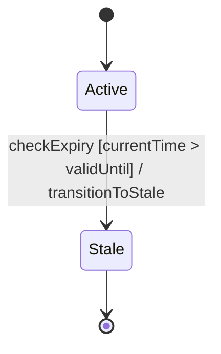

# User Story: Monitor Record Validity and Transition Stale Location State

## Domain Object Mapping
- **Primary Domain Objects:** `GeoLocation`, `TemporalConstraints`
- **Actor/Role:** `clientActor : ClientActor`

## BDD Scenario (OOA/OOD Realization)
**Given** a geographic location record with a valid-until expiration timestamp
**When** the current system time exceeds the valid-until timestamp
**Then** the location is classified as expired
And the system transitions the record status to stale/invalid

## UML Sequence Diagram


## UML State Machine Diagram


## Operational Context
```text
   valid-until is the timestamp for which this geo-location is valid
   until. If unspecified, the geo-location has no specific expiration
   time.
```

## Required Features Matrix
- [ ] #4 - [Feature: Temporal and Validity Attributes](https://github.com/gintatkinson/digipipe-tst20/blob/main/docs/features/feat-04-temporal-validity.md) (defines timestamp and valid-until attributes)

## Source References
Structural Schema: [ietf-geo-location.yang](https://github.com/YangModels/yang/blob/main/standard/ietf/RFC/ietf-geo-location%402022-02-11.yang)
Normative Specification: [RFC 9179 Section 2.7](https://datatracker.ietf.org/doc/rfc9179/)
