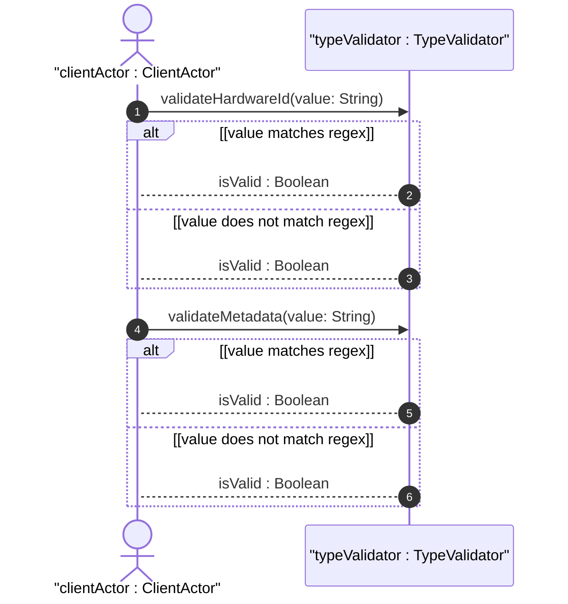

# User Story: Validate Hardware and Network Identifiers

## Domain Object Mapping
- **Primary Domain Objects:** `TypeValidator`, `HardwareIdentifiers`, `MetadataTypes`
- **Actor/Role:** `clientActor : ClientActor`

## BDD Scenario (OOA/OOD Realization)
**Given** a validation service that checks network and metadata standards
**When** the client submits a hardware MAC address or metadata tag identifier for verification
**Then** the system validates the value against the corresponding schema regex pattern
And returns a boolean indicating whether the input matches the standard format

## UML Sequence Diagram


## Operational Context
```text
   The mac-address type represents a MAC address in canonical,
   symmetric form: 6 octets represented in hexadecimal, separated
   by colons.
   
   The yang-identifier type represents a YANG identifier string.
   The yang-identifier definition has been aligned with YANG 1.1.
```

## Required Features Matrix
- [ ] #16 - [Feature: Network and Hardware Identifier Types](https://github.com/gintatkinson/digipipe-tst20/blob/main/docs/features/feat-08-hardware-identifiers.md) (defines validation constraints for mac-address, phys-address, uuid, and dotted-quad)
- [ ] #17 - [Feature: Metadata and Language Tag Types](https://github.com/gintatkinson/digipipe-tst20/blob/main/docs/features/feat-09-metadata-language.md) (defines validation constraints for object-identifier, xpath1.0, hex-string, language-tag, and yang-identifier)

## Source References
Structural Schema: [ietf-yang-types.yang](https://github.com/YangModels/yang/blob/main/standard/ietf/RFC/ietf-yang-types%402025-12-22.yang)
Normative Specification: [RFC 9911 Section 3](https://datatracker.ietf.org/doc/rfc9911/)
