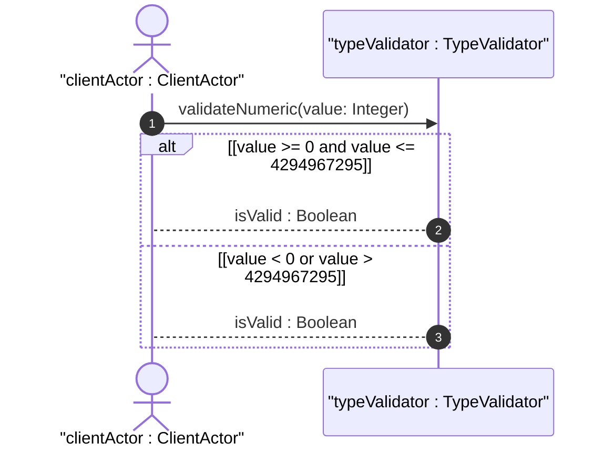

# User Story: Monitor Gauge Thresholds and Wrap Counters

## Domain Object Mapping
- **Primary Domain Objects:** `TypeValidator`, `NumericMetrics`
- **Actor/Role:** `clientActor : ClientActor`

## BDD Scenario (OOA/OOD Realization)
**Given** a counter32 variable is at its maximum value of 4294967295
**When** the system increments the counter value by 1
**Then** the counter32 value resets to 0
And when the system updates a gauge32 variable
**Then** the value is validated to be within the range [0, 4294967295]

## UML Sequence Diagram


## Operational Context
```text
   The counter32 type represents a non-negative integer that
   monotonically increases until it reaches a maximum value of 2^32-1
   (4294967295 decimal), when it wraps around and starts increasing
   again from zero.
```

## Required Features Matrix
- [ ] #13 - [Feature: Numeric Metric Types](https://github.com/gintatkinson/digipipe-tst20/blob/main/docs/features/feat-05-numeric-metrics.md) (defines validation ranges and wrap behavior for counters and gauges)

## Source References
Structural Schema: [ietf-yang-types.yang](https://github.com/YangModels/yang/blob/main/standard/ietf/RFC/ietf-yang-types%402025-12-22.yang)
Normative Specification: [RFC 9911 Section 3](https://datatracker.ietf.org/doc/rfc9911/)
