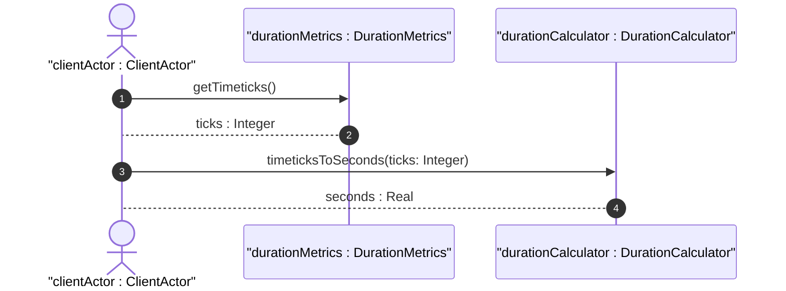

# User Story: Convert Timeticks and High-Resolution Durations

## Domain Object Mapping
- **Primary Domain Objects:** `DurationMetrics`, `DurationCalculator`
- **Actor/Role:** `clientActor : ClientActor`

## BDD Scenario (OOA/OOD Realization)
**Given** a duration value stored as timeticks representing hundredths of a second
**When** the system requests conversion to standard seconds
**Then** the duration calculator computes the derived value by dividing the timeticks by 100
And returns the resulting real number representation

## UML Sequence Diagram


## Operational Context
```text
   The timeticks type represents a non-negative integer that
   represents the time, modulo 2^32, in hundredths of a second
   between two epochs.
```

## Required Features Matrix
- [ ] #15 - [Feature: Duration and Measurement Units](https://github.com/gintatkinson/digipipe-tst20/blob/main/docs/features/feat-07-duration-measurement.md) (defines timeticks and high-resolution duration attributes and the DurationCalculator helper)

## Source References
Structural Schema: [ietf-yang-types.yang](https://github.com/YangModels/yang/blob/main/standard/ietf/RFC/ietf-yang-types%402025-12-22.yang)
Normative Specification: [RFC 9911 Section 4](https://datatracker.ietf.org/doc/rfc9911/)
