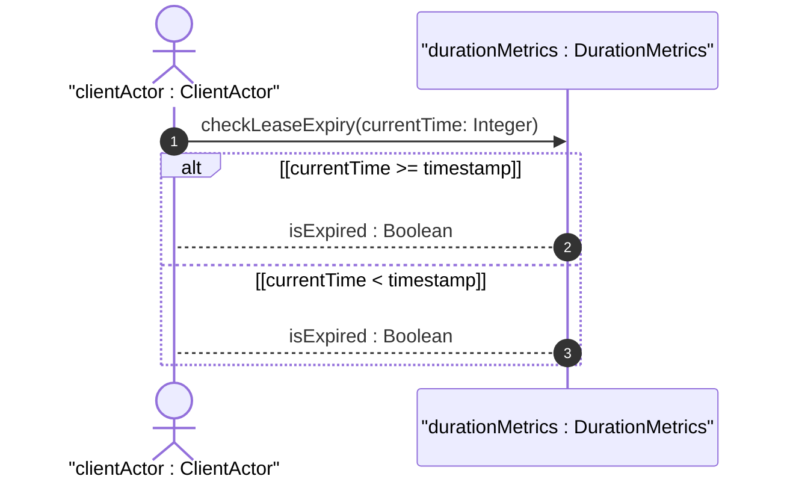
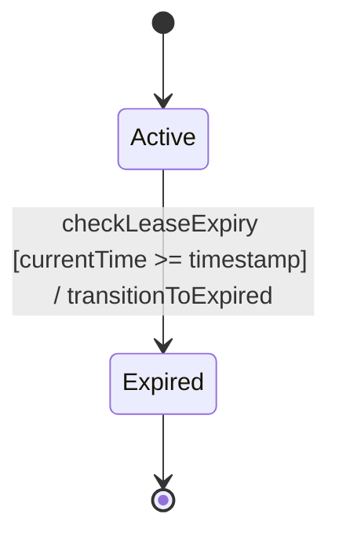

# User Story: Evaluate Lease Validity and Timeout Expirations

## Domain Object Mapping
- **Primary Domain Objects:** `TypeValidator`, `DurationMetrics`
- **Actor/Role:** `clientActor : ClientActor`

## BDD Scenario (OOA/OOD Realization)
**Given** a resource lease defined by an active state and an expiration timestamp
**When** the current system time is evaluated against the expiration timestamp
**Then** if the current time is greater than or equal to the expiration timestamp, the system transitions the lease state to Expired
And denies further access to the resource

## UML Sequence Diagram


## UML State Machine Diagram


## Operational Context
```text
   The timestamp type represents a non-negative integer that
   represents the time, modulo 2^32, in hundredths of a second
   since the system boot or a reference event occurred.
```

## Required Features Matrix
- [ ] #15 - [Feature: Duration and Measurement Units](https://github.com/gintatkinson/digipipe-tst20/blob/main/docs/features/feat-07-duration-measurement.md) (defines timeticks and timestamp attributes for determining lease duration and validity bounds)

## Source References
Structural Schema: [ietf-yang-types.yang](https://github.com/YangModels/yang/blob/main/standard/ietf/RFC/ietf-yang-types%402025-12-22.yang)
Normative Specification: [RFC 9911 Section 4](https://datatracker.ietf.org/doc/rfc9911/)
